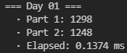
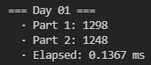
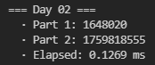
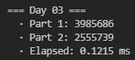
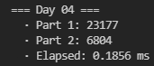
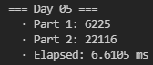
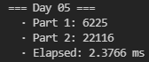
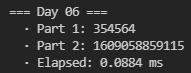
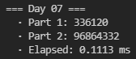

# AoC 2021 journal

As stated, my goal is to minimize the runtime of all days without deviating *too much* from idiomatic Rust. The extremely scientific methodology I'll follow will be to run each day a bunch of times in my computer and write down the [minimal](https://stackoverflow.com/a/43939840) runtime I get.

I'll keep updating this file with some commentary and discussion every day.

Of course, expect spoilers if you keep reading!

---
* **[Day 1](#day-1):** 0.1367 ms
* **[Day 2](#day-2):** 0.1269 ms
* **[Day 3](#day-3):** 0.1215 ms
* **[Day 4](#day-4):** 0.1856 ms
* **[Day 5](#day-5):** 2.3766 ms
* **[Day 6](#day-6):** 0.0884 ms
* **[Day 7](#day-7):** 0.1113 ms

---

# Day 1

First day! As usual, the first challenge is pretty simple. In this case, it involves sliding through a list of numbers with different window sizes.

My first intuition for part 1 was to `.zip()` both the numbers vector `numbers` and `numbers[1..]` to create the size 2 windows. While not technically incorrect, upon reading part 2, I learned that, conveniently, Rust already includes a `windows()` method that creates sliding windows over a slice.

Great! In that case, Part 1 is a simple one-liner:

```rust
let sol1 = numbers.windows(2).filter(|x| x[1] > x[0]).count() as u64;
```

In this case, the `u64` cast occurs because the type that I use to represent numeric solutions is `u64`, while `count()` returns `usize`. Anyways, I reckon in 64-bit systems this should be a no-op.

We can also use `windows()` for the bigger windows of part 2. In this case, my idea was to first get the windows, then map them to their respective sums, and then `window()` again over them to filter and count the pairs. This way, I avoid having to sum all 3-windows twice.

However, `windows()` cannot be used on map iterators. Thankfully, the great [itertools crate](https://docs.rs/itertools/latest/itertools/) provides `tuple_windows()` on any iterator:

```rust
let sol2 = numbers.windows(3).map(|x| x.iter().sum())
        .tuple_windows::<(u32, u32)>()
        .filter(|(a, b)| b > a)
        .count() as u64;
```

The result is 0.1374ms, and as expected, most of it is spent reading the file.



Can we do better? Yes. Should we? Well, the main optimization here that comes to mind is doing all operations as we are reading the file. In that case, we can arrive to both answers as soon as we finish reading the last line, by manually keeping track of the windows and previous values. Something like...

```rust
let mut win3 = [0, 0, 0];
let mut prev_win = 0;
let mut prev = 0;
let mut sol1 = 0;
let mut sol2 = 0;

read_to_string("input/day01.txt").unwrap().lines()
    .enumerate()
    .for_each(|(i, line)| {
        let val = line.parse::<u32>().unwrap();

        // Update the counter for part 1
        if i > 0 {
            if val > prev {
                sol1 += 1;
            }
            prev = val;
        }

        // Update the sliding window
        win3[i % 3] = val;
        let sum = win3.iter().sum();

        // If we have at least two full windows, compare it with the previous one
        if i > 3 && sum > prev_win {
            sol2 += 1;
        }

        prev_win = sum;
    });
```

This very verbose solution runs at around 0.11ms. While faster, I think we can sacrify 0.02 milliseconds for the sake of more concise and easy to read code.

EDIT: It has been pointed out to me on Twitter that part 2 can be simplified, since you only need to compare the number that changes when the window slides. So, we dont need to actually sum the numbers in the window, and both parts can be simplified to a generalization, where you compare pairs of numbers in the input separated by a certain distance.

This new solution is very elegant:
```rust
fn get_sol(ls: &[u32], n: usize) -> u64 {
    ls.windows(n+1).filter(|x| x[n] > x[0]).count() as u64
}

let sol1 = get_sol(&numbers, 1);
let sol2 = get_sol(&numbers, 3);
```

The runtime didn't change too much, since the bottleneck is clearly reading the file from disk, but it provided a tiny improvement:



Kudos to [@ajiiisai](https://github.com/ajiiisai) for discovering this neat trick!

# Day 2

Today is one of those "follow these pseudo-instructions and update some values" days. We have to move a submarine up, down and forward, and the twist in part 2 is that the depth is calculated differently, using some "aim" that you update when you go up and down.

At first, I implemented this declarative version to have some sort of baseline to compare against:

```rust
let (mut hor, mut aim, mut depth1, mut depth2) = (0, 0, 0, 0);
read_to_string("input/day02.txt").unwrap()
    .lines()
    .for_each(|line| {
        let spl: Vec<&str> = line.split(' ').collect();
        let val: i64 = spl[1].parse().unwrap();

        match spl[0] {
            "forward" => {
                hor += val;
                depth2 += aim * val;
            },
            "down" => {
                depth1 += val;
                aim += val;
            },
            "up" => {
                depth1 -= val;
                aim -= val;
            },
            _ => unreachable!()
        }
    });
```

The previous code does both parts at once, by updating whatever is necessary each step. This clocks in at around 0.256ms.

So, to try to make it both faster and prettier, I tried using iterators. If there's something I learned about iterators in Rust, it is that 1) they are your friends, and 2) they go brrrrr.

In that case, we can first convert each instruction to some kind of (x, y) pair, where moving forward is (x, 0) and moving up/down is (0, y). Then we apply the previous algorithm in a more functional way, by folding the iterator and updating the accumulated values:

```rust
let (hor, _, depth1, depth2) = read_to_string("input/day02.txt").unwrap()
    .lines()
    .map(|line| {
        let mut spl = line.split(' ');
        let op = spl.next().unwrap();
        let val: i64 = spl.next().unwrap().parse().unwrap();
        match op {
            "forward" => (val, 0),
            "up" => (0, -val),
            "down" => (0, val),
            _ => unreachable!()
        }
    }).fold((0, 0, 0, 0), |(hor, aim, depth1, depth2), mv| {
        match mv {
            (x, 0) => (hor + x, aim, depth1, depth2 + aim * x),
            (0, y) => (hor, aim + y, depth1 + y, depth2),
            _ => unreachable!()
        }
    });
```

I'm pretty happy with this solution. It's shorter, looks prettier, and indeed, iterators go brrrr:



# Day 3

Binary numbers today. We're tasked with finding the most common bit in each position for a whole bunch of binary number, and then constructing a new number that is composed of those majority bits.

To me, it seemed like it's one of those problems where there's some crazy bit operation that you can do which results in the most common bits, but I couldn't think of anything and I didn't find anything online. So, let's do it ourselves:

```rust
fn get_most_common_bit(numbers: &[Num], i: usize, reverse: bool) -> Num {
    let count = numbers.iter().copied().filter(|x| x & (1 << i) != 0).count();
    let more_ones = count * 2 >= numbers.len();
    match (more_ones, reverse) {
        (true, true) => 0,
        (true, false) => 1,
        (false, true) => 1,
        (false, false) => 0,
    }
}
```

`Num` is a type alias to `u16` that I defined, to fiddle with the size of the integers used. This will give 1 or 0 depending on the most common bit in the position `i` for all the numbers. The `reverse` flag will come in handy for part 2.

(Side note: initially, `more_ones` was `count >= numbers.len() / 2)`, however, this was problematic for an odd amount of numbers. If there are 7 numbers and 3 of them had a `1` in the desired position, `more_ones` should be false, since 4 numbers have a 0. However, `7 / 2 = 3` in integer division, so it was `true` instead).

We can then get the gamma and epsilon values:

```rust
let mut aux = 0; // We use this to calculate the number of bits in the input numbers
let numbers: Vec<Num> = read_to_string("input/day03.txt").unwrap()
    .lines()
    .map(|x| {
        let val = Num::from_str_radix(x, 2).unwrap();
        aux |= val;
        val
    })
    .collect();

let num_bits = TYPE_BITS - aux.leading_zeros() as usize;
    
// Construct both numbers for part 1
let mut gamma: Num = 0;
(0..num_bits).into_iter().for_each(|i| gamma |= get_most_common_bit(&numbers, i, false) << i);
let epsilon = !gamma & Num::MAX >> (TYPE_BITS - num_bits);
```

It is obviously important that we know the length in bits of the number we're given. Since I decided to take the bitwise operations route and not work with strings, one quick way to do it is to `or` all the numbers, and then count the number of leading zeros in an unsigned type of known size.

Then, we simply construct `gamma` by setting the most common bit to each position through a simple combination of logical ors and right shifts. `epsilon` is `gamma` with its bits flipped, but we must be careful not to flip the rest of the bits in the `u16` that don't belong to the number.

For part 2, we can use a function that keeps filtering the numbers, and returns the last one remaining:

```rust
fn get_part2_number(numbers: &[Num], most_common: bool, bits: usize) -> Num {
    let mut numbers: Vec<Num> = numbers.iter().copied().collect();
    let mut i = bits - 1;

    while numbers.len() > 1 {
        let mask = 1 << i;
        let target = get_most_common_bit(&numbers, i, !most_common) << i;
        numbers = numbers.into_iter().filter(|x| x & mask == target).collect();
        i -= 1;
    }

    numbers[0]
}
```

For each position (keep in mind that the *first* position is the *most* significant bit), we get the most common bits of the remaining numbers, and we filter out those whose bit is not the same. This is done by `and`ing the number with a mask, whose only set bit is that of the current position.

The code for this day is a bit longer than I would have liked, but pretty fast:



# Day 4

Time to play bingo! We're given a whole bunch of bingo boards, and the order in which the numbers are called.

I think this one is all about finding a nice way to represent the problem, and prevent the complexity from blowing up every time a number appears. The thought of looping through all the columns and rows in every board every single time makes me wanna cry.

I realized that knowing the order of the numbers beforehand gives us a huge advantage. Instead of storing the numbers *themselves* in the boards, we can replace them with *the order in which they appear*. For example, if 13 is the first number to be called, we replace 13 with 0. If the second one is 37, we replace 37 with 1, and so on.

This way, we can know precisely on which turn a row or column will be completed: it is the **maximum** value in said row or column. Then, we can also know the turn in which the board wins: the first row or column to be completed, that is, the **minimum** out of the maximums of all rows and columns.

This makes things much faster! We know when a board wins **as soon as we are done creating it**. Let's create a struct to represent our board:

```rust
struct BingoBoard {
    numbers: Vec<usize>,
}
```

I decided against using a 2D representation because it's a bit less flexible, it may be less cache friendly, and I didn't want to make any assumptions on the size of the boards. Treating a 1D representation as 2D isn't too hard anyway.

Then, let's see how to create a board from the string representation in the input:

```rust
impl BingoBoard {
    pub fn new(string: &str, indices: &[usize]) -> (Self, usize) {
        let n_lines = string.lines().count();
        let numbers = string.lines().into_iter().flat_map(
            |line| line.split_ascii_whitespace().map(|val| indices[val.parse::<usize>().unwrap()])
        ).collect_vec();
        let line_len = numbers.len() / n_lines;
        let min_rows = numbers.chunks(line_len).map(|line| line.iter().copied().max().unwrap()).min().unwrap();
        let min_columns = (0..line_len).map(|c| (0..n_lines).map(|r| numbers[c + r * line_len]).max().unwrap()).min().unwrap();

        (Self { numbers }, min(min_rows, min_columns))
    }
}
```

`indices` is an aux vector which maps a number to the moment in which it appears. We then turn each line of the board into the corresponding numbers, and concatenate them all through a flatmap to construct the vector. Then it's just a matter of finding the maximum values of all rows and columns, and selecting the minimum of them all. This is the moment in which this board wins.

Finally, it's just a matter of reading the input numbers into the `indices` array...

```rust
let input = read_to_string("input/day04.txt").unwrap();
let mut spl = input.split("\n\n");

// Construct the number to position vec
// This will allow us to quickly look up when a number appears in the bingo
let numbers: Vec<usize> = spl.next().unwrap().split(',').map(|x| x.parse().unwrap()).collect();
let mut indices = vec![0; numbers.len()];
for (i, val) in numbers.iter().copied().enumerate() {
    indices[val] = i;
}
```

...and building the boards, keeping track of which one is the first to win and lose, along which the corresponding turn when this happens...

```rust
let mut boards = Vec::with_capacity(50);
let mut winning_row_pos = usize::MAX;
let mut losing_row_pos = 0;
let mut winning_board_index = 0;
let mut losing_board_index = 0;

for (i, s) in spl.enumerate() {
    let (board, min) = BingoBoard::new(s, &indices);
    boards.push(board);

    if min < winning_row_pos {
        winning_row_pos = min;
        winning_board_index = i;
    } else if min > losing_row_pos {
        losing_row_pos = min;
        losing_board_index = i;
    }
}
```

Finally, we simply have to have a way to get the score of a board. The numbers to sum will be those that are greater to the turn in which the board wins. We also must have a way to convert back from *turn* numbers to their actual values, thanks to the `numbers` vector previously constructed:

```rust
impl BingoBoard {
    pub fn get_score(&self, pos: usize, numbers: &[usize]) -> u64 {
        let sum: usize = self.numbers.iter().copied().filter_map(|v| {
            if v > pos {
                Some(numbers[v])
            } else {
                None
            }
        }).sum();

        let n = numbers[pos];
        (sum * n) as u64
    }
}
```

And the solutions are...

```rust
let sol1 = boards[winning_board_index].get_score(winning_row_pos, &numbers);
let sol2 = boards[losing_board_index].get_score(losing_row_pos, &numbers);
```

For a total of 0.1856ms. The slowest part is apparently parsing spaces in the string (`.split_ascii_whitespace()`). `.split(' ')` doesn't work because, in order to be prettier, the input sometimes adds more than one space between the numbers. Splitting and then filtering for non-empty strings is roughly the same.



# Day 5

Today, we're basically given pairs of (x, y) coordinates, defining line segments, and we must find out how many points are shared by 2 or more of those segments. Initially, we must only consider horizontal or vertical lines. I thought part 2 would involve any kind of diagonals, but it turns out all diagonals are exactly 45 degrees, which makes things way easier.

Let's dive a bit into the data structures. We have coordinates (x, y) and pairs of coordinates defined in every line:

```rust
type CoordType = i16;
type CoordTuple = (CoordType, CoordType);

struct Coord {
    pub x: CoordType,
    pub y: CoordType
}

struct CoordPair {
    pub start: Coord,
    pub end: Coord
}
```

I defined a constructor from string for both the coordinates and the pairs, to easily map the lines of the input file into pairs of coordinates:

```rust
impl CoordPair {
    pub fn from_line(line: &str) -> Self {
        let mut spl = line.split(" -> ");
        let start = Coord::from_str(spl.next().unwrap());
        let end = Coord::from_str(spl.next().unwrap());
        Self { start, end }
    }
}

impl Coord {
    pub fn from_str(s: &str) -> Self {
        let mut spl = s.split(',');
        let x = spl.next().unwrap().parse().unwrap();
        let y = spl.next().unwrap().parse().unwrap();
        Self { x, y }
    }
}
```

As it turns out, the splits make things a bit slower (around 1ms), but as we'll see, it doesnt matter too much in the grand scheme of this day.

Wouldn't it be useful to have a method to determine if a segment is vertical or horizontal, to filter them out for part 1?

```rust
impl CoordPair {
    pub fn is_not_diagonal(&self) -> bool {
        self.start.x == self.end.x || self.start.y == self.end.y
    }
}
```

Now, let's handle the actual problem today: how do we generate the points that are contained in the segments? Since all segments are either vertical, horizontal or 45 degrees, we can go from `start` to `end` through every point by adding 1, 0 or -1 to each coordinate, depending on whether the end coordinate is greater or smaller than the start coordinate.

To take care of this process, I created an iterator to get all the points in a given segment:

```rust
struct PointIter {
    current: Coord,
    target: Coord,
    step: Coord,
}

impl Iterator for PointIter {
    type Item = CoordTuple;

    fn next(&mut self) -> Option<Self::Item> {
        match self.current {
            point if point == self.target => None,
            point => {
                self.current.x += self.step.x;
                self.current.y += self.step.y;
                Some((point.x, point.y))
            }
        }
    }
}

impl CoordPair {
    pub fn points_iter(&self) -> PointIter {
        let step = Coord{ x: diff(self.start.x, self.end.x), y: diff(self.start.y, self.end.y) };
        let target = Coord {x: self.end.x + step.x, y: self.end.y + step.y};
        PointIter { current: self.start, target, step }
    }
}
```

`diff()` returns -1, 0 or 1 depending on whether the first parameter is greater, equal or lower than the second, respectively.

After we've built these data structures, the calculation is relatively straightforward. Convert all lines to pairs of coordinates, get all points between them, add them to a map that keeps track of the amount of times each one has appeared, and get how many have appeared 2 times or more:

```rust
pub fn solve() -> SolutionPair {
    let mut points_count = FxHashMap::default();

    read_to_string("input/day05.txt").unwrap()
        .lines()
        .map(CoordPair::from_line)
        .for_each(|coord| {
            let points = coord.points_iter();
            let cnt = (if coord.is_not_diagonal() {1} else {0}, 1);

            points.for_each(|p| {
                let x = points_count.entry(p).or_insert((0, 0));
                *x = (x.0 + cnt.0, x.1 + cnt.1);
            });
        });


    let (sol1, sol2) = count_shared_points(&points_count);
    (Solution::UInt(sol1), Solution::UInt(sol2))
}

fn count_shared_points(map: &FxHashMap<CoordTuple, (u32, u32)>) -> (u64, u64) {
    map.values().fold((0, 0), |(sol1, sol2), (cnt1, cnt2)| {
        let next1 = if *cnt1 >= 2 {sol1 + 1} else {sol1};
        let next2 = if *cnt2 >= 2 {sol2 + 1} else {sol2};
        (next1, next2)
    })
}
```

There are a few design decisions here that are consequences of some experiments I did. I tried using the [Counter crate](https://docs.rs/counter/latest/counter/), but it was a bit too slow (~10ms), so I decided to use FxHashMaps from the [rustc-hash crate](https://docs.rs/rustc-hash/latest/rustc_hash/) and updating them myself. This crate provides HashSets and HashMaps using a hash function that is faster than that provided by the equivalent collections in `std::collections`. It has the downside of not being cryptographically secure, but that is not a property we need.

The whole hashing process is obviously the bottleneck today. My initial approach is keeping two hashmaps, one for each part. However, that means we have to hash each point twice. So instead, I use a single HashMap, where the values are the counts for parts 1 and 2 at the same time. The counter for part 2 is incremented inconditionally, while that for part 1 is only incremented if the segment is not diagonal.

Finally, we can count the number of points that appear 2 times or more for both solutions at once by folding the iterator manually and incrementing the values when needed.

This is the slowest one so far, with 6.6105ms. I can't think of any ways to avoid using the map right know, but I'll update this if I find an interesting optimization.



**UPDATE:** I came back to this day to try to make it run a bit faster. I thought about using a Vec to store how many times a point appears, which is much faster to access than a map, but this approach scales relatively poorly in terms of memory. The idea is to access a 2D coordinate in the array by computing its index as `y * <number of columns> + x`. To make sure that all possible `(x, y)` combinations have their own position in the array, it must be of size `m^2`, where `m` is the highest coordinate of any point.

Though in this case that is around 1000 and it would work, it would need too much memory if any single coordinate is too big, and I want my code to also work for bigger inputs. So, my idea was... what if we could use both?

Introducing... the `PointCounter` trait:

```rust
trait PointCounter {
    fn update(&mut self, point: Coord, increment: Coord);
    fn count(&self) -> Coord;
}
```

This defines a common interface that any point counter can implement with different backups. We can have one that uses a vec...

```rust
struct VecCounter {
    row_size: usize,
    counter: Vec<Coord>
}

impl VecCounter {
    pub fn new(max: CoordType) -> Self {
        let row_size = max as usize + 1;
        let counter = vec![Coord::zero(); row_size * row_size];
        Self { row_size, counter }
    }
}

impl PointCounter for VecCounter {
    fn update(&mut self, point: Coord, increment: Coord) {
        self.counter[point.y as usize * self.row_size + point.x as usize].increment(increment);
    }

    fn count(&self) -> Coord {
        self.counter.iter().fold(Coord::zero(), |acc, count| {
            let x = if count.x >= 2 {acc.x + 1} else {acc.x};
            let y = if count.y >= 2 {acc.y + 1} else {acc.y};
            Coord { x, y }
        })
    }
}
```

... and another one that uses a map...

```rust
struct MapCounter {
    counter: FxHashMap<Coord, Coord>
}

impl MapCounter {
    pub fn new() -> Self {
        Self { counter: FxHashMap::default() }
    }
}

impl PointCounter for MapCounter {
    fn update(&mut self, point: Coord, increment: Coord) {
        self.counter.entry(point).or_insert_with(Coord::zero).increment(increment);
    }

    fn count(&self) -> Coord {
        self.counter.values().fold(Coord::zero(), |acc, count| {
            let x = if count.x >= 2 {acc.x + 1} else {acc.x};
            let y = if count.y >= 2 {acc.y + 1} else {acc.y};
            Coord { x, y }
        })
    }
}
```

I also made some other changes, such as using a `Coord` as a conter for both parts. Now, we can define a function that solves the problem using any point counter backend:

```rust
fn solve_with(coords: &[CoordPair], mut solver: impl PointCounter) -> (u64, u64) {
    coords.iter().for_each(|coord| {
        let inc_1 = if coord.is_not_diagonal() {1} else {0};
        let increment = Coord {x: inc_1, y: 1};

        coord.points_iter().for_each(|p| solver.update(p, increment));
    });

    let counters = solver.count();
    (counters.x as u64, counters.y as u64)
}
```


And decide which backend to use on the fly, depending on the input:

```rust
pub fn solve() -> SolutionPair {
    let coords = read_to_string("input/day05.txt").unwrap()
        .lines()
        .map(CoordPair::from_line)
        .collect_vec();
        
    let max = coords.iter().map(|x| x.max()).max().unwrap();

    let (sol1, sol2) = if max <= 1000 {
        solve_with(&coords, VecCounter::new(max))
    } else {
        solve_with(&coords, MapCounter::new())
    };

    (Solution::UInt(sol1), Solution::UInt(sol2))
}
```

Maybe it's a bit overengineered, but I think it's pretty neat, being both fast and flexible. And the runtime for our input is now...



# Day 6

Today's one was relatively easy: we have a certain initial population of lanternfish, and we're told that each lanternfish produces another one every 6 days. However, their internal "clocks" are not all in sync, and additionally, every new lanternfish takes 2 more days to produce their first offspring, and after that they start their regular 6 day cycle.

I tried to come up with an equation to solve it analytically for like 5 minutes, but the +2 in the internal timer when a new fish is born made it a bit too hard for me. We're straight up told that this problem has an exponential growth, and conveniently, the problem statement lures you into a representation of the problem that does not scale too well.

As I said previously, the key to solving a problem efficiently is to come up with a good representation of it (and something I like a lot about Rust is that it makes you devote time to thinking about the data structures). I think the following code is pretty easy to follow:

```rust
struct FishTank {
    fish: [u128; 9]
}

impl FishTank {
    pub fn advance(&mut self, steps: u64) {
        for _ in 0..steps {
            self.step();
        }
    }

    fn step(&mut self) {
        let zeros = self.fish[0];
        for i in 1..9 {
            self.fish[i-1] = self.fish[i];
        }
        self.fish[8] = zeros;
        self.fish[6] += zeros;
    }
}
```

Instead of keeping a list of all the fish represented as their internal timers, as the problem statement does, a much nicer way to represent this is to keep track of *how many fish* are in a certain moment of the period. Since the maximum internal clock a fish can have is 8, we can have an array of size 9, where position 0 represents the amount of fish whose timer is 0, and so on.

The way to advance one day is to push all the values forward in the array, which represents moving forward all the fish's internal clocks. Special care must be put to those that are in position 0: they reset to 6, and produce one new fish with an internal clock of 8. Hence, we copy the value in `fish[0]` to `fish[8]`, to add the new batch of lanternfish, and add their count to those whose clock is 6.

I chose to use `u128` to be extra careful, as the values seemed to escalate pretty quickly, as expected in an exponential series. However, it turns out `u64` is enough, but I`ll leave this way for compatibility with bigger inputs or larger time periods.

Overall, the main function is very simple...

```rust
pub fn solve() -> SolutionPair {
    let input = read_to_string("input/day06.txt").unwrap();
    let mut tank = FishTank::from_string(&input);

    tank.advance(80);
    let sol1 = tank.count_fish();

    tank.advance(256 - 80);
    let sol2 = tank.count_fish();

    (Solution::BigUInt(sol1), Solution::BigUInt(sol2))
}
```

And clocks in at a blazing fast 0.0884 milliseconds, the fastest one yet to make up for yesterday's :)



# Day 7

Today's problem was very easy, but interesting nonetheless. We have the positions of a bunch of crabs on an axis, and we must basically find the position that minimizes the sum of the distances to all crabs. For part 2, the distance is computed differently: 1 step equals 1, 2 steps are 1+2, 3 steps are 1+2+3, and so on.

Before showing any code, I'll explain the progress my solution went through. First, I coded the obvious approach with a for loop: going from 0 to the maximum value where a crab is, analyzing the cost in each step, and then picking the lowest one. Part 2 was the same, changing the function used to evaluate the cost of moving a crab. I also remembered that `1+2+...+N` can be computed as `N * (N+1) / 2` for part 2 (however, if you do `(1..n).into_iter().sum()` in Rust, the compiler will optimize it to the previous expression anyway).

It works, but the complexity is really bad, and it took around 3ms. After some research, I learned that [it can be proven that the value which minimizes the absolute distances to all other values in a list is the median](https://math.stackexchange.com/questions/113270/the-median-minimizes-the-sum-of-absolute-deviations-the-ell-1-norm). So, we can skip the for in part 1 and simply sort the list, pick the median (which is the value in the middle of the sorted list), and compute the cost for that value.

Very nice. Can we do anything similar to avoid looping in part 2? This is where it got interesting. Out of pure intuition, I tried using the average value instead of the median to compute part 2 on that value. It worked. I had no clue why it worked.

I tried to come up with a proof of why the average value minimizes the n(n+1) sums, but I gave up after a while. I was unsure whether this was a simple oddity or an actual general solution that will work every time.

[Someone on reddit](https://www.reddit.com/r/adventofcode/comments/rar7ty/2021_day_7_solutions/hnkbtug/) showed that the best value is guaranteed to be within 0.5 of the average value. This means that we can round the average, and it will indeed be the best value to compute part 2.

All in all, after learning all this, it's a simple solution:

```rust
pub fn solve() -> SolutionPair {
    let mut crabs: Vec<i32> = read_to_string("input/day07.txt").unwrap()
        .split(',')
        .map(|x| x.parse().unwrap())
        .collect();

    crabs.sort_unstable(); //_unstable is faster for primitives such as i32
    let median = crabs[crabs.len() / 2];
    let sol1 = get_sol1_for_pos(&crabs, median);

    let avg = (crabs.iter().sum::<i32>() as f32 / crabs.len() as f32).round() as i32;
    let sol2 = get_sol2_for_pos(&crabs, avg as i32);
   
    (Solution::Int32(sol1), Solution::Int32(sol2))
}

fn get_sol1_for_pos(crabs: &[i32], pos: i32) -> i32 {
    crabs.iter().map(|x| (x-pos).abs()).sum()
}

fn get_sol2_for_pos(crabs: &[i32], pos: i32) -> i32 {
    crabs.iter().map(|x| {
        let diff = (x-pos).abs();
        diff * (diff + 1) / 2
    }).sum()
}
```

And avoiding loops gives us a runtime that is more in line with the rest of the days. Today's problem was easy to solve initially, but it's one of those days where you learn something interesting.
