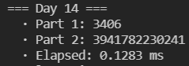
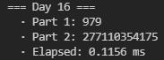
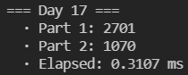
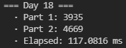
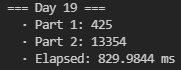

# AoC 2021 journal

As stated, my goal is to minimize the runtime of all days without deviating *too much* from idiomatic Rust. The extremely scientific methodology I'll follow will be to run each day a bunch of times in my computer and write down the [minimal](https://stackoverflow.com/a/43939840) runtime I get.

I'll keep updating this file with some commentary and discussion every day.

Of course, expect spoilers if you keep reading!

---

* **[Day 1](#day-1):** 0.1367 ms
* **[Day 2](#day-2):** 0.1269 ms
* **[Day 3](#day-3):** 0.1215 ms
* **[Day 4](#day-4):** 0.1856 ms
* **[Day 5](#day-5):** 2.3766 ms
* **[Day 6](#day-6):** 0.0884 ms
* **[Day 7](#day-7):** 0.1113 ms
* **[Day 8](#day-8):** 0.2128 ms
* **[Day 9](#day-9):** 1.1991 ms
* **[Day 10](#day-10):** 0.1462 ms
* **[Day 11](#day-11):** 0.2798 ms
* **[Day 12](#day-12):** 3.3025 ms
* **[Day 13](#day-13):** 0.4933 ms
* **[Day 14](#day-14):** 0.1283 ms
* **[Day 15](#day-15):** 30.8155 ms
* **[Day 16](#day-16):** 0.1156 ms
* **[Day 17](#day-17):** 0.3107 ms
* **[Day 18](#day-18):** 117.0816 ms
* **[Day 19](#day-19):** 829.9844 ms

---

# Day 1

First day! As usual, the first challenge is pretty simple. In this case, it involves sliding through a list of numbers with different window sizes.

My first intuition for part 1 was to `.zip()` both the numbers vector `numbers` and `numbers[1..]` to create the size 2 windows. While not technically incorrect, upon reading part 2, I learned that, conveniently, Rust already includes a `windows()` method that creates sliding windows over a slice.

Great! In that case, Part 1 is a simple one-liner:

```rust
let sol1 = numbers.windows(2).filter(|x| x[1] > x[0]).count() as u64;
```

In this case, the `u64` cast occurs because the type that I use to represent numeric solutions is `u64`, while `count()` returns `usize`. Anyways, I reckon in 64-bit systems this should be a no-op.

We can also use `windows()` for the bigger windows of part 2. In this case, my idea was to first get the windows, then map them to their respective sums, and then `window()` again over them to filter and count the pairs. This way, I avoid having to sum all 3-windows twice.

However, `windows()` cannot be used on map iterators. Thankfully, the great [itertools crate](https://docs.rs/itertools/latest/itertools/) provides `tuple_windows()` on any iterator:

```rust
let sol2 = numbers.windows(3).map(|x| x.iter().sum())
        .tuple_windows::<(u32, u32)>()
        .filter(|(a, b)| b > a)
        .count() as u64;
```

The result is 0.1374ms, and as expected, most of it is spent reading the file.


Can we do better? Yes. Should we? Well, the main optimization here that comes to mind is doing all operations as we are reading the file. In that case, we can arrive to both answers as soon as we finish reading the last line, by manually keeping track of the windows and previous values. Something like...

```rust
let mut win3 = [0, 0, 0];
let mut prev_win = 0;
let mut prev = 0;
let mut sol1 = 0;
let mut sol2 = 0;

read_to_string("input/day01.txt").unwrap().lines()
    .enumerate()
    .for_each(|(i, line)| {
        let val = line.parse::<u32>().unwrap();

        // Update the counter for part 1
        if i > 0 {
            if val > prev {
                sol1 += 1;
            }
            prev = val;
        }

        // Update the sliding window
        win3[i % 3] = val;
        let sum = win3.iter().sum();

        // If we have at least two full windows, compare it with the previous one
        if i > 3 && sum > prev_win {
            sol2 += 1;
        }

        prev_win = sum;
    });
```

This very verbose solution runs at around 0.11ms. While faster, I think we can sacrify 0.02 milliseconds for the sake of more concise and easy to read code.

EDIT: It has been pointed out to me on Twitter that part 2 can be simplified, since you only need to compare the number that changes when the window slides. So, we dont need to actually sum the numbers in the window, and both parts can be simplified to a generalization, where you compare pairs of numbers in the input separated by a certain distance.

This new solution is very elegant:
```rust
fn get_sol(ls: &[u32], n: usize) -> u64 {
    ls.windows(n+1).filter(|x| x[n] > x[0]).count() as u64
}

let sol1 = get_sol(&numbers, 1);
let sol2 = get_sol(&numbers, 3);
```

The runtime didn't change too much, since the bottleneck is clearly reading the file from disk, but it provided a tiny improvement:


Kudos to [@ajiiisai](https://github.com/ajiiisai) for discovering this neat trick!

# Day 2

Today is one of those "follow these pseudo-instructions and update some values" days. We have to move a submarine up, down and forward, and the twist in part 2 is that the depth is calculated differently, using some "aim" that you update when you go up and down.

At first, I implemented this declarative version to have some sort of baseline to compare against:

```rust
let (mut hor, mut aim, mut depth1, mut depth2) = (0, 0, 0, 0);
read_to_string("input/day02.txt").unwrap()
    .lines()
    .for_each(|line| {
        let spl: Vec<&str> = line.split(' ').collect();
        let val: i64 = spl[1].parse().unwrap();

        match spl[0] {
            "forward" => {
                hor += val;
                depth2 += aim * val;
            },
            "down" => {
                depth1 += val;
                aim += val;
            },
            "up" => {
                depth1 -= val;
                aim -= val;
            },
            _ => unreachable!()
        }
    });
```

The previous code does both parts at once, by updating whatever is necessary each step. This clocks in at around 0.256ms.

So, to try to make it both faster and prettier, I tried using iterators. If there's something I learned about iterators in Rust, it is that 1) they are your friends, and 2) they go brrrrr.

In that case, we can first convert each instruction to some kind of (x, y) pair, where moving forward is (x, 0) and moving up/down is (0, y). Then we apply the previous algorithm in a more functional way, by folding the iterator and updating the accumulated values:

```rust
let (hor, _, depth1, depth2) = read_to_string("input/day02.txt").unwrap()
    .lines()
    .map(|line| {
        let mut spl = line.split(' ');
        let op = spl.next().unwrap();
        let val: i64 = spl.next().unwrap().parse().unwrap();
        match op {
            "forward" => (val, 0),
            "up" => (0, -val),
            "down" => (0, val),
            _ => unreachable!()
        }
    }).fold((0, 0, 0, 0), |(hor, aim, depth1, depth2), mv| {
        match mv {
            (x, 0) => (hor + x, aim, depth1, depth2 + aim * x),
            (0, y) => (hor, aim + y, depth1 + y, depth2),
            _ => unreachable!()
        }
    });
```

I'm pretty happy with this solution. It's shorter, looks prettier, and indeed, iterators go brrrr:


# Day 3

Binary numbers today. We're tasked with finding the most common bit in each position for a whole bunch of binary number, and then constructing a new number that is composed of those majority bits.

To me, it seemed like it's one of those problems where there's some crazy bit operation that you can do which results in the most common bits, but I couldn't think of anything and I didn't find anything online. So, let's do it ourselves:

```rust
fn get_most_common_bit(numbers: &[Num], i: usize, reverse: bool) -> Num {
    let count = numbers.iter().copied().filter(|x| x & (1 << i) != 0).count();
    let more_ones = count * 2 >= numbers.len();
    match (more_ones, reverse) {
        (true, true) => 0,
        (true, false) => 1,
        (false, true) => 1,
        (false, false) => 0,
    }
}
```

`Num` is a type alias to `u16` that I defined, to fiddle with the size of the integers used. This will give 1 or 0 depending on the most common bit in the position `i` for all the numbers. The `reverse` flag will come in handy for part 2.

(Side note: initially, `more_ones` was `count >= numbers.len() / 2)`, however, this was problematic for an odd amount of numbers. If there are 7 numbers and 3 of them had a `1` in the desired position, `more_ones` should be false, since 4 numbers have a 0. However, `7 / 2 = 3` in integer division, so it was `true` instead).

We can then get the gamma and epsilon values:

```rust
let mut aux = 0; // We use this to calculate the number of bits in the input numbers
let numbers: Vec<Num> = read_to_string("input/day03.txt").unwrap()
    .lines()
    .map(|x| {
        let val = Num::from_str_radix(x, 2).unwrap();
        aux |= val;
        val
    })
    .collect();

let num_bits = TYPE_BITS - aux.leading_zeros() as usize;
    
// Construct both numbers for part 1
let mut gamma: Num = 0;
(0..num_bits).into_iter().for_each(|i| gamma |= get_most_common_bit(&numbers, i, false) << i);
let epsilon = !gamma & Num::MAX >> (TYPE_BITS - num_bits);
```

It is obviously important that we know the length in bits of the number we're given. Since I decided to take the bitwise operations route and not work with strings, one quick way to do it is to `or` all the numbers, and then count the number of leading zeros in an unsigned type of known size.

Then, we simply construct `gamma` by setting the most common bit to each position through a simple combination of logical ors and right shifts. `epsilon` is `gamma` with its bits flipped, but we must be careful not to flip the rest of the bits in the `u16` that don't belong to the number.

For part 2, we can use a function that keeps filtering the numbers, and returns the last one remaining:

```rust
fn get_part2_number(numbers: &[Num], most_common: bool, bits: usize) -> Num {
    let mut numbers: Vec<Num> = numbers.iter().copied().collect();
    let mut i = bits - 1;

    while numbers.len() > 1 {
        let mask = 1 << i;
        let target = get_most_common_bit(&numbers, i, !most_common) << i;
        numbers = numbers.into_iter().filter(|x| x & mask == target).collect();
        i -= 1;
    }

    numbers[0]
}
```

For each position (keep in mind that the *first* position is the *most* significant bit), we get the most common bits of the remaining numbers, and we filter out those whose bit is not the same. This is done by `and`ing the number with a mask, whose only set bit is that of the current position.

The code for this day is a bit longer than I would have liked, but pretty fast:


# Day 4

Time to play bingo! We're given a whole bunch of bingo boards, and the order in which the numbers are called.

I think this one is all about finding a nice way to represent the problem, and prevent the complexity from blowing up every time a number appears. The thought of looping through all the columns and rows in every board every single time makes me wanna cry.

I realized that knowing the order of the numbers beforehand gives us a huge advantage. Instead of storing the numbers *themselves* in the boards, we can replace them with *the order in which they appear*. For example, if 13 is the first number to be called, we replace 13 with 0. If the second one is 37, we replace 37 with 1, and so on.

This way, we can know precisely on which turn a row or column will be completed: it is the **maximum** value in said row or column. Then, we can also know the turn in which the board wins: the first row or column to be completed, that is, the **minimum** out of the maximums of all rows and columns.

This makes things much faster! We know when a board wins **as soon as we are done creating it**. Let's create a struct to represent our board:

```rust
struct BingoBoard {
    numbers: Vec<usize>,
}
```

I decided against using a 2D representation because it's a bit less flexible, it may be less cache friendly, and I didn't want to make any assumptions on the size of the boards. Treating a 1D representation as 2D isn't too hard anyway.

Then, let's see how to create a board from the string representation in the input:

```rust
impl BingoBoard {
    pub fn new(string: &str, indices: &[usize]) -> (Self, usize) {
        let n_lines = string.lines().count();
        let numbers = string.lines().into_iter().flat_map(
            |line| line.split_ascii_whitespace().map(|val| indices[val.parse::<usize>().unwrap()])
        ).collect_vec();
        let line_len = numbers.len() / n_lines;
        let min_rows = numbers.chunks(line_len).map(|line| line.iter().copied().max().unwrap()).min().unwrap();
        let min_columns = (0..line_len).map(|c| (0..n_lines).map(|r| numbers[c + r * line_len]).max().unwrap()).min().unwrap();

        (Self { numbers }, min(min_rows, min_columns))
    }
}
```

`indices` is an aux vector which maps a number to the moment in which it appears. We then turn each line of the board into the corresponding numbers, and concatenate them all through a flatmap to construct the vector. Then it's just a matter of finding the maximum values of all rows and columns, and selecting the minimum of them all. This is the moment in which this board wins.

Finally, it's just a matter of reading the input numbers into the `indices` array...

```rust
let input = read_to_string("input/day04.txt").unwrap();
let mut spl = input.split("\n\n");

// Construct the number to position vec
// This will allow us to quickly look up when a number appears in the bingo
let numbers: Vec<usize> = spl.next().unwrap().split(',').map(|x| x.parse().unwrap()).collect();
let mut indices = vec![0; numbers.len()];
for (i, val) in numbers.iter().copied().enumerate() {
    indices[val] = i;
}
```

...and building the boards, keeping track of which one is the first to win and lose, along which the corresponding turn when this happens...

```rust
let mut boards = Vec::with_capacity(50);
let mut winning_row_pos = usize::MAX;
let mut losing_row_pos = 0;
let mut winning_board_index = 0;
let mut losing_board_index = 0;

for (i, s) in spl.enumerate() {
    let (board, min) = BingoBoard::new(s, &indices);
    boards.push(board);

    if min < winning_row_pos {
        winning_row_pos = min;
        winning_board_index = i;
    } else if min > losing_row_pos {
        losing_row_pos = min;
        losing_board_index = i;
    }
}
```

Finally, we simply have to have a way to get the score of a board. The numbers to sum will be those that are greater to the turn in which the board wins. We also must have a way to convert back from *turn* numbers to their actual values, thanks to the `numbers` vector previously constructed:

```rust
impl BingoBoard {
    pub fn get_score(&self, pos: usize, numbers: &[usize]) -> u64 {
        let sum: usize = self.numbers.iter().copied().filter_map(|v| {
            if v > pos {
                Some(numbers[v])
            } else {
                None
            }
        }).sum();

        let n = numbers[pos];
        (sum * n) as u64
    }
}
```

And the solutions are...

```rust
let sol1 = boards[winning_board_index].get_score(winning_row_pos, &numbers);
let sol2 = boards[losing_board_index].get_score(losing_row_pos, &numbers);
```

For a total of 0.1856ms. The slowest part is apparently parsing spaces in the string (`.split_ascii_whitespace()`). `.split(' ')` doesn't work because, in order to be prettier, the input sometimes adds more than one space between the numbers. Splitting and then filtering for non-empty strings is roughly the same.


# Day 5

Today, we're basically given pairs of (x, y) coordinates, defining line segments, and we must find out how many points are shared by 2 or more of those segments. Initially, we must only consider horizontal or vertical lines. I thought part 2 would involve any kind of diagonals, but it turns out all diagonals are exactly 45 degrees, which makes things way easier.

Let's dive a bit into the data structures. We have coordinates (x, y) and pairs of coordinates defined in every line:

```rust
type CoordType = i16;
type CoordTuple = (CoordType, CoordType);

struct Coord {
    pub x: CoordType,
    pub y: CoordType
}

struct CoordPair {
    pub start: Coord,
    pub end: Coord
}
```

I defined a constructor from string for both the coordinates and the pairs, to easily map the lines of the input file into pairs of coordinates:

```rust
impl CoordPair {
    pub fn from_line(line: &str) -> Self {
        let mut spl = line.split(" -> ");
        let start = Coord::from_str(spl.next().unwrap());
        let end = Coord::from_str(spl.next().unwrap());
        Self { start, end }
    }
}

impl Coord {
    pub fn from_str(s: &str) -> Self {
        let mut spl = s.split(',');
        let x = spl.next().unwrap().parse().unwrap();
        let y = spl.next().unwrap().parse().unwrap();
        Self { x, y }
    }
}
```

As it turns out, the splits make things a bit slower (around 1ms), but as we'll see, it doesnt matter too much in the grand scheme of this day.

Wouldn't it be useful to have a method to determine if a segment is vertical or horizontal, to filter them out for part 1?

```rust
impl CoordPair {
    pub fn is_not_diagonal(&self) -> bool {
        self.start.x == self.end.x || self.start.y == self.end.y
    }
}
```

Now, let's handle the actual problem today: how do we generate the points that are contained in the segments? Since all segments are either vertical, horizontal or 45 degrees, we can go from `start` to `end` through every point by adding 1, 0 or -1 to each coordinate, depending on whether the end coordinate is greater or smaller than the start coordinate.

To take care of this process, I created an iterator to get all the points in a given segment:

```rust
struct PointIter {
    current: Coord,
    target: Coord,
    step: Coord,
}

impl Iterator for PointIter {
    type Item = CoordTuple;

    fn next(&mut self) -> Option<Self::Item> {
        match self.current {
            point if point == self.target => None,
            point => {
                self.current.x += self.step.x;
                self.current.y += self.step.y;
                Some((point.x, point.y))
            }
        }
    }
}

impl CoordPair {
    pub fn points_iter(&self) -> PointIter {
        let step = Coord{ x: diff(self.start.x, self.end.x), y: diff(self.start.y, self.end.y) };
        let target = Coord {x: self.end.x + step.x, y: self.end.y + step.y};
        PointIter { current: self.start, target, step }
    }
}
```

`diff()` returns -1, 0 or 1 depending on whether the first parameter is greater, equal or lower than the second, respectively.

After we've built these data structures, the calculation is relatively straightforward. Convert all lines to pairs of coordinates, get all points between them, add them to a map that keeps track of the amount of times each one has appeared, and get how many have appeared 2 times or more:

```rust
pub fn solve() -> SolutionPair {
    let mut points_count = FxHashMap::default();

    read_to_string("input/day05.txt").unwrap()
        .lines()
        .map(CoordPair::from_line)
        .for_each(|coord| {
            let points = coord.points_iter();
            let cnt = (if coord.is_not_diagonal() {1} else {0}, 1);

            points.for_each(|p| {
                let x = points_count.entry(p).or_insert((0, 0));
                *x = (x.0 + cnt.0, x.1 + cnt.1);
            });
        });


    let (sol1, sol2) = count_shared_points(&points_count);
    (Solution::UInt(sol1), Solution::UInt(sol2))
}

fn count_shared_points(map: &FxHashMap<CoordTuple, (u32, u32)>) -> (u64, u64) {
    map.values().fold((0, 0), |(sol1, sol2), (cnt1, cnt2)| {
        let next1 = if *cnt1 >= 2 {sol1 + 1} else {sol1};
        let next2 = if *cnt2 >= 2 {sol2 + 1} else {sol2};
        (next1, next2)
    })
}
```

There are a few design decisions here that are consequences of some experiments I did. I tried using the [Counter crate](https://docs.rs/counter/latest/counter/), but it was a bit too slow (~10ms), so I decided to use FxHashMaps from the [rustc-hash crate](https://docs.rs/rustc-hash/latest/rustc_hash/) and updating them myself. This crate provides HashSets and HashMaps using a hash function that is faster than that provided by the equivalent collections in `std::collections`. It has the downside of not being cryptographically secure, but that is not a property we need.

The whole hashing process is obviously the bottleneck today. My initial approach is keeping two hashmaps, one for each part. However, that means we have to hash each point twice. So instead, I use a single HashMap, where the values are the counts for parts 1 and 2 at the same time. The counter for part 2 is incremented inconditionally, while that for part 1 is only incremented if the segment is not diagonal.

Finally, we can count the number of points that appear 2 times or more for both solutions at once by folding the iterator manually and incrementing the values when needed.

This is the slowest one so far, with 6.6105ms. I can't think of any ways to avoid using the map right know, but I'll update this if I find an interesting optimization.


**UPDATE:** I came back to this day to try to make it run a bit faster. I thought about using a Vec to store how many times a point appears, which is much faster to access than a map, but this approach scales relatively poorly in terms of memory. The idea is to access a 2D coordinate in the array by computing its index as `y * <number of columns> + x`. To make sure that all possible `(x, y)` combinations have their own position in the array, it must be of size `m^2`, where `m` is the highest coordinate of any point.

Though in this case that is around 1000 and it would work, it would need too much memory if any single coordinate is too big, and I want my code to also work for bigger inputs. So, my idea was... what if we could use both?

Introducing... the `PointCounter` trait:

```rust
trait PointCounter {
    fn update(&mut self, point: Coord, increment: Coord);
    fn count(&self) -> Coord;
}
```

This defines a common interface that any point counter can implement with different backends. We can have one that uses a vec...

```rust
struct VecCounter {
    row_size: usize,
    counter: Vec<Coord>
}

impl VecCounter {
    pub fn new(max: CoordType) -> Self {
        let row_size = max as usize + 1;
        let counter = vec![Coord::zero(); row_size * row_size];
        Self { row_size, counter }
    }
}

impl PointCounter for VecCounter {
    fn update(&mut self, point: Coord, increment: Coord) {
        self.counter[point.y as usize * self.row_size + point.x as usize].increment(increment);
    }

    fn count(&self) -> Coord {
        self.counter.iter().fold(Coord::zero(), |acc, count| {
            let x = if count.x >= 2 {acc.x + 1} else {acc.x};
            let y = if count.y >= 2 {acc.y + 1} else {acc.y};
            Coord { x, y }
        })
    }
}
```

... and another one that uses a map...

```rust
struct MapCounter {
    counter: FxHashMap<Coord, Coord>
}

impl MapCounter {
    pub fn new() -> Self {
        Self { counter: FxHashMap::default() }
    }
}

impl PointCounter for MapCounter {
    fn update(&mut self, point: Coord, increment: Coord) {
        self.counter.entry(point).or_insert_with(Coord::zero).increment(increment);
    }

    fn count(&self) -> Coord {
        self.counter.values().fold(Coord::zero(), |acc, count| {
            let x = if count.x >= 2 {acc.x + 1} else {acc.x};
            let y = if count.y >= 2 {acc.y + 1} else {acc.y};
            Coord { x, y }
        })
    }
}
```

I also made some other changes, such as using a `Coord` as a counter for both parts. Now, we can define a function that solves the problem using any point counter backend:

```rust
fn solve_with(coords: &[CoordPair], mut solver: impl PointCounter) -> (u64, u64) {
    coords.iter().for_each(|coord| {
        let inc_1 = if coord.is_not_diagonal() {1} else {0};
        let increment = Coord {x: inc_1, y: 1};

        coord.points_iter().for_each(|p| solver.update(p, increment));
    });

    let counters = solver.count();
    (counters.x as u64, counters.y as u64)
}
```


And decide which backend to use on the fly, depending on the input:

```rust
pub fn solve() -> SolutionPair {
    let coords = read_to_string("input/day05.txt").unwrap()
        .lines()
        .map(CoordPair::from_line)
        .collect_vec();
        
    let max = coords.iter().map(|x| x.max()).max().unwrap();

    let (sol1, sol2) = if max <= 1000 {
        solve_with(&coords, VecCounter::new(max))
    } else {
        solve_with(&coords, MapCounter::new())
    };

    (Solution::UInt(sol1), Solution::UInt(sol2))
}
```

Maybe it's a bit overengineered, but I think it's pretty neat, being both fast and flexible. And the runtime for our input is now...


# Day 6

Today's one was relatively easy: we have a certain initial population of lanternfish, and we're told that each lanternfish produces another one every 6 days. However, their internal "clocks" are not all in sync, and additionally, every new lanternfish takes 2 more days to produce their first offspring, and after that they start their regular 6 day cycle.

I tried to come up with an equation to solve it analytically for like 5 minutes, but the +2 in the internal timer when a new fish is born made it a bit too hard for me. We're straight up told that this problem has an exponential growth, and conveniently, the problem statement lures you into a representation of the problem that does not scale too well.

As I said previously, the key to solving a problem efficiently is to come up with a good representation of it (and something I like a lot about Rust is that it makes you devote time to thinking about the data structures). I think the following code is pretty easy to follow:

```rust
struct FishTank {
    fish: [u128; 9]
}

impl FishTank {
    pub fn advance(&mut self, steps: u64) {
        for _ in 0..steps {
            self.step();
        }
    }

    fn step(&mut self) {
        let zeros = self.fish[0];
        for i in 1..9 {
            self.fish[i-1] = self.fish[i];
        }
        self.fish[8] = zeros;
        self.fish[6] += zeros;
    }
}
```

Instead of keeping a list of all the fish represented as their internal timers, as the problem statement does, a much nicer way to represent this is to keep track of *how many fish* are in a certain moment of the period. Since the maximum internal clock a fish can have is 8, we can have an array of size 9, where position 0 represents the amount of fish whose timer is 0, and so on.

The way to advance one day is to push all the values forward in the array, which represents moving forward all the fish's internal clocks. Special care must be put to those that are in position 0: they reset to 6, and produce one new fish with an internal clock of 8. Hence, we copy the value in `fish[0]` to `fish[8]`, to add the new batch of lanternfish, and add their count to those whose clock is 6.

I chose to use `u128` to be extra careful, as the values seemed to escalate pretty quickly, as expected in an exponential series. However, it turns out `u64` is enough, but I`ll leave this way for compatibility with bigger inputs or larger time periods.

Overall, the main function is very simple...

```rust
pub fn solve() -> SolutionPair {
    let input = read_to_string("input/day06.txt").unwrap();
    let mut tank = FishTank::from_string(&input);

    tank.advance(80);
    let sol1 = tank.count_fish();

    tank.advance(256 - 80);
    let sol2 = tank.count_fish();

    (Solution::BigUInt(sol1), Solution::BigUInt(sol2))
}
```

And clocks in at a blazing fast 0.0884 milliseconds, the fastest one yet to make up for yesterday's :)


# Day 7

Today's problem was very easy, but interesting nonetheless. We have the positions of a bunch of crabs on an axis, and we must basically find the position that minimizes the sum of the distances to all crabs. For part 2, the distance is computed differently: 1 step equals 1, 2 steps are 1+2, 3 steps are 1+2+3, and so on.

Before showing any code, I'll explain the progress my solution went through. First, I coded the obvious approach with a for loop: going from 0 to the maximum value where a crab is, analyzing the cost in each step, and then picking the lowest one. Part 2 was the same, changing the function used to evaluate the cost of moving a crab. I also remembered that `1+2+...+N` can be computed as `N * (N+1) / 2` for part 2 (however, if you do `(1..n).into_iter().sum()` in Rust, the compiler will optimize it to the previous expression anyway).

It works, but the complexity is really bad, and it took around 3ms. After some research, I learned that [it can be proven that the value which minimizes the absolute distances to all other values in a list is the median](https://math.stackexchange.com/questions/113270/the-median-minimizes-the-sum-of-absolute-deviations-the-ell-1-norm). So, we can skip the for in part 1 and simply sort the list, pick the median (which is the value in the middle of the sorted list), and compute the cost for that value.

Very nice. Can we do anything similar to avoid looping in part 2? This is where it got interesting. Out of pure intuition, I tried using the average value instead of the median to compute part 2 on that value. It worked. I had no clue why it worked.

I tried to come up with a proof of why the average value minimizes the n(n+1) sums, but I gave up after a while. I was unsure whether this was a simple oddity or an actual general solution that will work every time.

[Someone on reddit](https://www.reddit.com/r/adventofcode/comments/rar7ty/2021_day_7_solutions/hnkbtug/) showed that the best value is guaranteed to be within 0.5 of the average value. This means that we can round the average, and it will indeed be the best value to compute part 2.

All in all, after learning all this, it's a simple solution:

```rust
pub fn solve() -> SolutionPair {
    let mut crabs: Vec<i32> = read_to_string("input/day07.txt").unwrap()
        .split(',')
        .map(|x| x.parse().unwrap())
        .collect();

    crabs.sort_unstable(); //_unstable is faster for primitives such as i32
    let median = crabs[crabs.len() / 2];
    let sol1 = get_sol1_for_pos(&crabs, median);

    let avg = (crabs.iter().sum::<i32>() as f32 / crabs.len() as f32).round() as i32;
    let sol2 = get_sol2_for_pos(&crabs, avg as i32);
   
    (Solution::Int32(sol1), Solution::Int32(sol2))
}

fn get_sol1_for_pos(crabs: &[i32], pos: i32) -> i32 {
    crabs.iter().map(|x| (x-pos).abs()).sum()
}

fn get_sol2_for_pos(crabs: &[i32], pos: i32) -> i32 {
    crabs.iter().map(|x| {
        let diff = (x-pos).abs();
        diff * (diff + 1) / 2
    }).sum()
}
```

And avoiding loops gives us a runtime that is more in line with the rest of the days. Today's problem was easy to solve initially, but it's one of those days where you learn something interesting.


# Day 8
I think today's problem was the first big filter, and it was also a lot of fun. We are given some 7-segment displays that are malfunctioning, the inputs to the segments are messed up. We must find out which inputs belong to which segments, and then decode some numbers.

The inputs are encoded as letters from `a` to `h`. We know that each letter corresponds to a segment, but we don't know to which one. To solve it, we are given the inputs for all 10 possible digits, where both the letters (inputs for the segments) and the digits themselves are in any possible order.

I'll focus only on part 2, since part 1 is uninteresting and can be solved either without actually resolving the segments, or trivially after the segments are solved. Also, for simplicity, I'll focus only on a single row of the input. All rows can be decoded using this method.

I denoted all 7 segments using the numbers 0-6, as follows:

```
 00000000
1        2
1        2
1        2
 33333333
4        5
4        5
4        5
 66666666
```

Now, let's dive into the representation of the problem. I decided to represent all the inputs as 8-bit numbers, where each bit indicates that a certain segment is on. So, the letter `a` is `00000001`, `b` is `00000010`, and something like `abd` would be `00001011`. Each bit always corresponds to the same segment, but we don't kno yet to which one in an ordinary 7-bit display. Note that the most significant bit is always unused, as there are only 7 possible segments.

So, I decided to represent each row using this struct:

```rust
struct SegmentDecoder {
    digits: [u8; 10],
    four: u8,
    seven: u8,
    reading: Vec<u8>,
}
```

`digits` always has length 10, as it contains the examples for digits 0 to 9. `reading` is the part always the separator. It seems that it always has 4 elements, but I didn't wanna bother checking the whole input, so I store them in a vec for flexibility. `four` and `seven` are the 8-bit segment representations of said numbers. Even if we don't know which segments are which yet, they can be unambiguously found, as they are the only ones which use four and three segments, respectively (aka, they have 4 and 3 1's). As we'll see, they'll come in handy in a moment.

Ok, so how do we resolve which bit corresponds to which segment? After analyzing the problem a bit, I found that there is a way to resolve 3 segments immediately: in all the digits 0 to 9, the segments 1, 4 and 5 are used 6, 4 and 9 times respectively. Segments 0 and 2 are used 8 times, and segments 3 and 6 are used 7 times.

To leverage this, we can go through `i = 1 to 7` and count how many times the bit `i` is set throughout all of the 10 examples. If the count is 6, 4 or 9, we know that the bit `i` corresponds to the segment 1, 4 or 5 respectively. If the count is 7 or 8, we don't know about that bit yet. We have figured out segments 1, 4 and 5.

To figure out the rest, I'll keep an aditional 8-bit numbers, whose bits are 1 if we have already figured out the segment corresponding to the bit in that position. Let's call it `resolved`. By this point, the bits that correspond to segments `1, 4, 5` will be set to 1, because we know which ones they are.

After the previous process, the bits that correspond to segments 0, 2, 3 and 6 are unknown. But they can be resolved too. Let's consider the way the numbers 4 and 7 are represented in a 7-segment display: 4 uses the segments `1, 2, 3, 5`, and 7 uses `0, 2, 5`. If we take the segments used by the number `4`, and remove those that are also used by seven, we have `1, 3`. In our code, this means that if we do `four & ~seven`, we will have a number with only 2 bits set, those corresponding to segments 1 and 3. But we already know about segment 1! It's set to one in our `resolved` variable. If we remove the ones we know about too, it turns out that `four & ~seven & ~resolved` will only have one bit set, that corresponding to segment 3.

We can keep figuring out the rest this way. As discussed, the number 4 uses segments `1, 2, 3, 5`, but we already know about segments `1, 3, 4, 5`, so a simple `four & ~resolved` gives us segment 2. Only segments 5 and 6 remain. Turns out, the number 7 only has one segment that we don't know about: `seven & ~resolved` gives us segment 5. Finally, segment 6 must be the one remaining.

```rust
pub fn resolve(&self) -> [u8; 7] {
    let mut resolved = 0;
    let mut corresp = [0; 7];

    // We can resolve segments 1, 4 and 5 just from how many times they appear
    for i in 0..8 {
        let mask = 1 << i;
        let sum = self.digits.iter().filter(|x| *x & mask != 0).count();
        let val = match sum {
            4 => Some(4),
            6 => Some(1),
            9 => Some(5),
            _ => None
        };

        if let Some(x) = val {
            corresp[x] = mask;
            resolved |= mask;
        }
    }

    // The rest can be obtained by process of elimination
    corresp[3] = self.four & !self.seven & !resolved;
    resolved |= corresp[3];
    corresp[2] = self.four & !resolved;
    resolved |= corresp[2];
    corresp[0] = self.seven & !resolved;
    resolved |= corresp[0];
    corresp[6] = !resolved & 0x7F; // dont set the 8th bit to 1

    corresp
}
```

The process of segment resolution returns an array of 7 elements: position `i` contains an 8-bit number, with a set bit that corresponds to segment `i`.

With this correspondence, we can go and figure out the numbers after the separator. It's a bit ugly, since we must construct the binary representation of all digits 0-9, but after that it's a matter or finding which one's which:

```rust
pub fn get_answers(&self, corresp: [u8; 7]) -> (u64, u64) {
    let seven = self.seven;
    let four = self.four ;
    let one = seven ^ corresp[0];
    let three = seven | corresp[3] | corresp[6];
    let eight = three | corresp[1] | corresp[4];
    let two = eight ^ corresp[1] ^ corresp[5];
    let five = eight ^ corresp[2] ^ corresp[4];
    let zero = eight ^ corresp[3];
    let six = eight ^ corresp[2];
    let nine = eight ^ corresp[4];

    let (mut part1, mut part2) = (0, 0);

    for val in self.reading.iter().copied() {
        let number = match val {
            x if x == zero => 0,
            x if x == one => 1,
            x if x == two => 2,
            x if x == three => 3,
            x if x == four => 4,
            x if x == five => 5,
            x if x == six => 6,
            x if x == seven => 7,
            x if x == eight => 8,
            x if x == nine => 9,
            _ => unreachable!(),
        };

        part2 = part2 * 10 + number;
        if number == 1 || number == 4 || number == 7 || number == 8 {
            part1 += 1;
        }
    
    }

    (part1, part2)
}
```

In the end, we can simply associate one resolver with each line, get the answers for both parts and sum it all together:

```rust
pub fn solve() -> SolutionPair {
    let (sol1, sol2) = read_to_string("input/day08.txt").unwrap()
        .lines()
        .map(|line| {
            let decoder = SegmentDecoder::from_line(line);
            let corresp = decoder.resolve();
            decoder.get_answers(corresp)
        })
        .reduce(|(a1, a2), (b1, b2)| (a1 + b1, a2 + b2))
        .unwrap();

    (Solution::UInt(sol1), Solution::UInt(sol2))
}
```
Given the task, it's not too slow:


# Day 9

Our task today is to analyze a depth map, and find points whose value is lower than those around it. Then, we are told that each of those points has an associated basin, areas where the height keeps decreasing towards them, and we must compute the sizes of said basins.

Part 1 is relatively straightforward: for every position, we visit those that are nearby, and we check that all of them are higher. Part 2 is more interesting, and it's probably the first appearance yet of a classical algorithm. Given the definition of a basin, how can we get its size?

We are told that each low is associated with exactly one basin, and that all points in the map, except for 9's, are also associated with only one basin. Thus, we can go through each point and compute the size of the basin around it. If it is not a low, the process stops and the size of the basin is 0. Otherwise, we get the size for part 2, and add the value of the point for part 1.

The size of a basin is best computed recursively: given one central point, which will initially be the lowest of the basin, we mark it as "visited", and then we obtain the points in its vicinity that are higher than it and have not been visited yet. The size of the basin is thus 1 (the current center) plus the size of the basin in all 4 directions. This process keeps going until we reach a 9, or all points around the center have already been visited, or the height around all points decreases again.

I stored all the information in this struct:

```rust
struct HeightMap {
    pub heights: Vec<u8>,
    pub visited: Vec<bool>,
    pub rows: usize,
    pub columns: usize
}
```

Given that the size of the map is variable between the examples and the actual input, I decided to use a vec to store both the heights and the visited marks, and also store the number of rows and columns to easily convert from 1D to 2D.

So, the size of the basin around a certain position is computed as...

```rust
fn get_basin_size(height_data: &mut HeightMap, pos: usize) -> u64 {
    let val = height_data.heights[pos];
    if val == 9 || height_data.visited[pos] {
        return 0;
    }

    let nearby_unvisited = height_data.nearby(pos).into_iter().filter(|&i| !height_data.visited[i]).collect_vec();
    let is_min = nearby_unvisited.iter().all(|&pos| height_data.heights[pos] >= val);

    if is_min {
        height_data.visited[pos] = true;
        1 + nearby_unvisited.iter().map(|&i| get_basin_size(height_data, i)).sum::<u64>()
    } else {
        0
    }
}
```

`height_data.nearby(pos)` returns the adjacent positions of a given one. We use it to get those near the current position that have not yet been visited. If the current one is the highest among the unvisited neighbors, we are still in the basin, and we add the size of it in all directions.

Given that, we can use this function for both solutions:

```rust
pub fn solve() -> SolutionPair {
    let s = read_to_string("input/day09.txt").unwrap();
    let mut height_data = HeightMap::from_str(&s);

    let mut sol1 = 0;
    let mut basins = vec![];

    for pos in 0..height_data.heights.len() {
        let basin_size = get_basin_size(&mut height_data, pos);
        if basin_size > 0 {
            basins.push(basin_size);
            sol1 += height_data.heights[pos] as u64 + 1;
        }
    }

    basins.sort_unstable_by(|a, b| b.cmp(a));
    let sol2 = basins[..3].iter().product();

    (Solution::UInt(sol1), Solution::UInt(sol2))
}
```

This is probably not the most efficient thing in the world, and can surely be optimized (especially the function used to get the adjacent positions, which is quite ugly). I'll probably do so in the next few days, to try to get it under 1ms:


# Day 10

It looks like today someone fucked some code up, and we have syntax errors everywhere. More specifically, we have four kinds of *chunks*: `{}`, `[]`, `()` and `<>`. They can be empty, like the ones I just showed, or can recursively contain one or more other chunks, for example, `[{[<(){}>]}(<><>)]` is a valid chunk. Our input is a list of such chunks, however, they are all **corrupt** or **incomplete**.

Corrupt chunks have a closing character that is not expected, for example, `[()()>`, where `>` should be `]` instead. Incomplete chunks don't have that problem, but they are missing one or more closing characters at the end that would make them valid. Part 1 is about finding corrupt chunks and determining which character is the offending one, while part 2 asks us to complete incomplete chunks.

My first attempt was to build a recursive chunk parser for part 1, which would give an error if it found an unexpected closing character. While it worked, I then realized that it was more inefficient than using a LIFO (last in first out) stack, which I will anyways need for part 2.

The idea is the following: you go through all the characters in the line, and:
- If it's an opening character, you push the corresponding closing char onto the stack
- If it's a closing character, you pop the one you have at the top of the stack. If it's the same, everything's good. If it's different, you just encountered an unexpected closing character, and the chunk is corrupt.

If you get to the end, then the line is incomplete, and the closing characters in the stack are exactly those you need to complete it.

Then, it makes sense to map all the lines to either *corrupted* or *incomplete*, with their associated scores as defined by the problem:

```rust
enum LineResult {
    Corrupted { score: u64 },
    Incomplete { score: u64 },
}
```

Our chunk analyzer will perform exactly the procedure described before, and return an instance of the previous enum depending on the result:

```rust
fn analyze_line(line: &str) -> LineResult {
    let mut closers = Vec::with_capacity(100);

    for ch in line.chars() {
        match ch {
            '{' => closers.push('}'),
            '[' => closers.push(']'),
            '(' => closers.push(')'),
            '<' => closers.push('>'),
            '}' | ']' | ')' | '>' => {
                if closers.pop().unwrap() != ch {
                    let score = match ch {
                        ')' => 3,
                        ']' => 57,
                        '}' => 1197,
                        '>' => 25137,
                         _  => unreachable!()
                    };
                    return LineResult::Corrupted{ score };
                }
            },
            _ => unreachable!()
        }
    }

    get_completion_score(&closers)
}
```

If we get to the end, then we must complete the line with the closing characters in the stack, and compute the associated score:

```rust
fn get_completion_score(closers: &[char]) -> LineResult {
    let mut score = 0;
    for ch in closers.iter().rev() {
        score = score * 5 + match ch {
            ')' => 1,
            ']' => 2,
            '}' => 3,
            '>' => 4,
             _  => unreachable!()
        };
    }
    LineResult::Incomplete{score}
}
```

Finally, we just have to analyze each line, and process the scores as stated in the problem:

```rust
pub fn solve() -> SolutionPair {
    let input = read_to_string("input/day10.txt").unwrap();
    let mut sol1 = 0;
    let mut sol2_scores = Vec::with_capacity(100);

    input.lines().for_each(|line| match analyze_line(line) {
        LineResult::Corrupted{score} => sol1 += score,
        LineResult::Incomplete{score} => sol2_scores.push(score),
    });

    sol2_scores.sort_unstable();
    let sol2 = sol2_scores[sol2_scores.len() / 2];

    (Solution::UInt(sol1), Solution::UInt(sol2))
}
```

Which results in a very speedy 0.14ms:


# Day 11

Today's problem reminded me a lot of [this Veritasium video](https://www.youtube.com/watch?v=t-_VPRCtiUg), it deals with synchronization in a bioluminiscence process. More specifically, we have a grid of 10x10 octopuses which can flash with light. Each octopus has an internal clock that counts from 0 to 9, and it's incremented on each step. Upon reaching 10, it emits a pulse of light and resets to 0. Also, when an octopus flashes, it increments the clocks of all other octopuses around it. This all happens in the same step, so a single flash caused by the +1 increment can lead to many more.

My implementation is relatively straightforward: I have a 10x10, 2D array which contains the octopuses represented as their clocks. On each step, the following process is executed:

- Increment all counters by 1. If a counter reaches 10, which means the octopus in that position is going to flash on this step, reset it to 0 and add its position to a list of octopuses that flash.

- For each octopus that flashes, call a recursive function that counts the total amount of flashes that result from that one. This function increments the counter of all nearby octopuses and, if any of them reaches 10, it resets its to 0 and calls itself on the new position.

This is how the implementation looks like:

```rust
// Performs one step and returns the number of flashes
fn do_step(grid: &mut Grid) -> usize {
    let mut n_flashes = 0;
    let mut flash_pos = Vec::with_capacity(100);

    grid.iter_mut().enumerate().for_each(|(row, arr)| {
        arr.iter_mut().enumerate().for_each(|(col, val)| {
            *val = (*val + 1) % 10;
            if *val == 0 {
                flash_pos.push((row, col));
            }
        })
    });

    for (row, col) in flash_pos {
        n_flashes += flash(grid, row, col);
    }

    n_flashes
}

// Flashes one position, increments the nearby ones and returns the number
// of total flashes as a consequence
fn flash(grid: &mut Grid, row: usize, col: usize) -> usize {
    let mut total_flashes = 1;

    for (dx, dy) in WINDOW_STEPS {
        let new_row = row as i8 + dx;
        let new_col = col as i8 + dy;
        if new_row < 0 || new_row == GRID_SIZE as i8 || new_col < 0 || new_col == GRID_SIZE as i8 {
            continue;
        }

        match &mut grid[new_row as usize][new_col as usize] {
            0 => {},
            v if *v == 9 => {
                *v = 0;
                total_flashes += flash(grid, new_row as usize, new_col as usize);
            },
            v => *v += 1,
        };
    }

    total_flashes
}
```

I tried to use recursiveness straight away on the points that flashed upon increment, to avoid having to store them in a vector and then process them, but it didn't work because then I would have to keep track of which ones are 0 from the previous step, which can be incremented by one, and which ones are 0 because they already flashed this turn, which should not be incremented. So, I decided to leave it like this.

To solve both parts, we can sum the total amount of flashes in the first 100 steps, then leave it running until all octopuses flash at once:

```rust
pub fn solve() -> SolutionPair {
    let input = read_to_string("input/day11.txt").unwrap();
    let mut grid = read_input(&input);
    let mut flashes = 0;

    for _ in 0..100 {
        flashes += do_step(&mut grid);
    }

    let mut steps = 101;
    while do_step(&mut grid) != GRID_SIZE * GRID_SIZE {
        steps += 1;
    }

    (Solution::UInt(flashes as u64), Solution::UInt(steps))
}
```

I don't know if there is a more analytical way to solve it. I was expecting part 2 to be one of those days where they ask you to run part 1 for ten more million steps, but it was relatively quick:


# Day 12

Some cool algorithms today! We are given the layout of a set of communicating caves, and we must find the number of total possible paths from the start cave to the end cave. However, there's some more conditions: there are big and small caves. Big caves can be visited as often as desired, but each small cave can only be visited once. Furthermore, part 2 relaxes the last condition a bit, and it allows us to visit one particular small cave at most twice, and all other once at most.

With all these conditions, we must find a way to examine all possible paths between the two caves.

I think a recursive approach is the most natural way to proceed here: we will have a recursive function that knows where we are right now, where we want to end up, and all the caves that we have already visited. We will also need some sort of map, that given a cave, returns the list of all other caves connected to it.

Then, we will start at the current cave, and evaluate our choices. The caves we can go to are all big caves connected to the actual one, and the connected small ones that we have not visited yet. The number of paths from the current position to the goal will be the sum of all possible paths for each direction that we can take (recursive calls to the function, updating the current cave and the visited ones). If the next cave we can go to is the goal cave, instead of calling recursively, we just add 1 to the total paths.

My first implementation, just to get a feel of the problem, did exactly that. The core of the solution is a `pathfinder` function that receives all the information discussed above. The caves are identified with strings using their names, and the connectivity info is a map from String to a list of Strings. I also managed to generalize it for part 2: it receives a boolean flag to determine the part to solve, and another boolean flag to remember if we have visited any small cave more than once.

```rust
fn pathfinder<'a, 'b>(
    conn: &'a ConnectivityMap, 
    from: &'a str, 
    to: &'a str, 
    visited_small_caves: &'b mut Vec<&'a str>,
    part2: bool,
    mut small_visited_twice: bool,
) -> u64 {
    let mut paths = 0;
    let mut current_small = false;

    if from.chars().next().unwrap().is_ascii_lowercase() {
        current_small = true;
        visited_small_caves.push(from);

        if part2 && !small_visited_twice && visited_small_caves.iter().filter(|&&cave| cave == from).count() == 2 {
            small_visited_twice = true;
        }
    }

    let caves_to_visit = conn[from].iter().filter(|cave| !visited_small_caves.contains(cave) || part2 && !small_visited_twice).collect_vec();

    for next_cave in caves_to_visit {
        if *next_cave == to {
            paths += 1;
        } else {
            paths += pathfinder(conn, next_cave, to, visited_small_caves, part2, small_visited_twice);
        }
    }

    if current_small {
        visited_small_caves.pop();
    }

    paths
}
```

We use the casing of the name of the current cave to determine if it's a small one or not. If it is, and we have already visited it, we set the corresponding boolean flag. The generation of possible caves to go to can be generalized for both parts: either it is not present in the list of small caves that we have already visited, or we are solving part 2 and we have not visited any single small cave yet.

Adding an extra function to abstract the previous one a bit, and excluding parsing the input, this can be used to solve the problem:

```rust
type ConnectivityMap<'a> = FxHashMap<&'a str, Vec<&'a str>>;

pub fn solve() -> SolutionPair {
    let input_data = read_to_string("input/day12.txt").unwrap();
    let connects = load_connectivity(&input_data);
    let sol1 = n_paths_between(&connects, "start", "end", false);
    let sol2 = n_paths_between(&connects, "start", "end", true);
    (Solution::UInt(sol1), Solution::UInt(sol2))
}

fn n_paths_between(conn: &ConnectivityMap, from: &str, to: &str, part2: bool) -> u64 {
    pathfinder(conn, from, to, &mut vec![], part2, false)
}
```

This solution takes around **50ms**. Okay-ish, but can be improved.

Coding a chess engine as a side project has taught me that representing stuff using bits can speed things up quite a lot. I thought for a bit, and I found a way to leverage bit operations to make this solution much faster.

Let's do something similar to what we did with the 7-segment displays. Instead of representing caves as strings, each individual cave will be an `u64` number, with only one bit set. For example, `start` will be `00...0001`, `A` will be `00.0010`, and so on. This representation will allow us to use ands and ors liberally.

If we represent caves this way, we lose the information about which ones are small and which ones are big. To preserve it, we will have an extra number, `small_caves`, which will have set bits corresponding to those of the small caves. It can be computed as simply the bitwise `or` of all small caves.

This, in addition to simplifying some stuff with lifetimes, also makes some of the most costly operations in the previous function virtually as fast as it gets. Now, instead of remembering the small caves we have visited with a list, we will simply `or` them into an `u64` that will contain the bits of the visited caves. If we want to know if we have visited a cave, we simply have to check that `cave & visited != 0`. Since `cave` only has one bit set, the result can only be different to zero if that bit has been marked as visited in the visited caves `u64`. Similarly, we can know if a cave is a small cave with `cave & small_caves != 0`.

One more neat trick: the connectivity map. We can replace it with a list, whose size is the number of caves. Each position contains an `u64`, with set bits corresponding to those of the caves you can visit from that one. So... we use the value of the cave itself to index the list? Not exactly. Since they only have 1 set bit, they are essentially powers of 2. If we have 10 caves, the last one would have a value of `2^10`, and it clearly isn't a good idea to have a list of that size only to store 10 values. The way to do it is to count the zeros at the end of the binary representation of the cave. That way, `00....01` is `0`, `00.....010` is `1`, and so on.

The new and shiny `pathfinder` function looks like this:

```rust
fn pathfinder(conn: &[u64], small_caves: u64, from: u64, to: u64, visited: u64, part2: bool, mut small_visited_twice: bool) -> u64 {
    let mut paths = 0;

    if part2 && !small_visited_twice && (from & small_caves & visited) != 0 {
        small_visited_twice = true;
    }

    paths += get_cave_ids(conn[from.trailing_zeros() as usize])
        .filter(|cave| (cave & small_caves & visited) == 0 || part2 && !small_visited_twice)
        .map(|next_cave| match next_cave {
            x if x == to => 1,
            _ => pathfinder(conn, small_caves, next_cave, to, visited | from, part2, small_visited_twice)
        })
        .sum::<u64>();

    paths
}
```

One question may remain: ok, we can index a list to get the accesible caves from each one, but, for example, `0000...00111` means that we can access cave 0, 1 and 2. However, we iterate over them using their individual values: `00...0001`, `00...0010` and `00...0100`. How can we get the individual bit components of a number as a separate number?

This is something I almost copy-pasted from my chess engine. Turns out there is a way to iterate over such numbers, given one base number with some bits set. That's exactly what `get_cave_ids()` does:

```rust
struct CaveIter {
    val: u64
}

impl Iterator for CaveIter {
    type Item = u64;

    fn next(&mut self) -> Option<Self::Item> {
        match self.val {
            0 => None,
            x => {
                self.val = x & (x - 1);
                Some(1 << x.trailing_zeros())
            }
        }
    }
}

fn get_cave_ids(val: u64) -> CaveIter {
    CaveIter { val }
}
```

It is just a wrapper that returns an iterator. That iterator scans the first set bit of a number, returns another number with just that bit set, and sets it to 0 in the stored number. When the internal number is 0, no more values are yielded. `self.val = x & (x - 1)` may be confusing. The short explanation is: if you `and` a number with itself minus 1, the result will be the original number with the rightmost 1 bit flipped to 0.

I skipped all the details regarding the input processing required to do this. It's not hard, just a bit lengthy. It can be found in the [source code](src/days/day12.rs#L41).

And now, we can solve day 12 in a blazing fast...


# Day 13

After yesterday's fun with recursion, we have something simpler today. We have a bunch of points as (x, y) coordinates, and a bunch of folds over the X or Y axis. These points are in a transparent sheet, and upon folding it as required, their coordinates change (they may even overlap with other points). Part 1 only asks us to do the first fold and count how many unique points remain as a result. For part 2, we must do all folds and visually represent the resulting points.

I made this day pretty struct-heavy, which allows for some nice, functional-style code.

The points and folds are stored using these structs:

```rust
enum Fold {
    YFold { y: usize },
    XFold { x: usize },
}

struct Point {
    pub x: usize,
    pub y: usize
}
```

`Fold` is an enum because it is always handy being able to `match` over the two possible types.

Let's give `Point` some functionality. Given a `Fold`, we can implement a method to apply the fold to the point, and return a new one with the appropriate coordinates:

```rust
impl Point {
    pub fn apply_fold(&self, fold: Fold) -> Self {
        let (x, y) = match fold {
            XFold{x} => (if self.x > x {2 * x - self.x} else {self.x}, self.y),
            YFold{y} => (self.x, if self.y > y {2 * y - self.y} else {self.y}),
        };

        Self {x, y}
    }
}
```

The formula for how to update the coordinates may seem a bit weird at first, but it's easy to deduce. If we are folding over the Y axis, i.e. over a horizontal line. the X coordinate will remain unchanged. Moreover, the Y coordinate will only help if it is below the point of the fold. It is relatively straightforward to come up with the way to obtain the new Y: `fold.y - (point.y - fold.y)`, which can be simplified as `2*fold.y - point.y`. The same considerations apply for a fold over the X axis.

For part 2, I also added a method to apply a series of folds, in a way that is a bit more efficient that calling the previous method multiple times:

```rust
impl Point {
    pub fn apply_fold_list(&self, folds: &[Fold]) -> Self {
        let mut x = self.x;
        let mut y = self.y;

        folds.iter().for_each(|fold| {
            match fold {
                XFold{x: x_fold} if *x_fold < x => x = 2 * *x_fold - x,
                YFold{y: y_fold} if *y_fold < y => y = 2 * *y_fold - y,
                _ => {},
            }
        });

        Self {x, y}
    }
}
```

Again, I will skip the code for reading the input, which is relatively boring.

When we have all the points and folds, we can solve part 1 with...

```rust
pub fn solve() -> SolutionPair {
    let input = read_to_string("input/day13.txt").unwrap();
    let (points, folds) = read_data(&input);

    let new_points = points.into_iter().map(|p| p.apply_fold(folds[0])).unique().collect_vec();
    let sol1 = new_points.len() as u64;
    [...]
}
```

For part 2, we can keep applying the rest of the folds to get the final points:

```rust
pub fn solve() -> SolutionPair {
    [...]
    let (cols, rows) = get_rows_cols(&folds);
    let mut chars = vec![' '; rows as usize * cols as usize];
    new_points.into_iter()
        .map(|p| p.apply_fold_list(&folds[1..]))
        .for_each(|point| {
            let pos = point.y * cols + point.x;
            chars[pos] = '';
        });

    let sol2 = "\n".to_owned() + &chars.chunks(cols)
        .map(String::from_iter)
        .join("\n");

    (Solution::UInt(sol1), Solution::Str(sol2))
}
```

To get the number of rows and columns of the final string representation, we just have to find the minimum X and Y values of the folds, and that is precisely what `get_rows_cols()` does. When we know them, we can transform the points into the final positions, and put a big chonky black square character in that position. 

For the final representation, we simply split the character vectors into chunks having `cols` characters each, and join them with newlines. The final output is pretty cool, I love days where they make you build some sort of visual representation of some letters:


# Day 14

After some delay updating this, I'm finally up to date! Today's problem involves synthetizing chemicals. The input is a string with a bunch of characters, and some rules about how the characters combine to increase the length of the chemical product. I'll assume you're familiar with the details of the problem.

This is another exponential problem: the chemical almost doubles its length on each step. We are asked to count the most and least common element after 10 steps (part 1) and 40 steps (part 2).

If you try to bruteforce your way into this one, you'll end up with a chemical that's gonna be a few billion characters long. Is there another way to do it?

This one seemed to me pretty similar to the lanternfish problem. They show you a representation that escales exponentionally and it's up to you to find a more optimal way.

My solution was to count how many of each pair of characters we have in each step. Thanks to the composition rules, we know which pairs are derived from which ones. For example, `AB -> C` means that, for each `AB` pair in one step, the following step will have as many `
AC` and `CB` pairs. If you think about it, the order of the pairs is not important at all, so it's not needed to represent them with a string or a list.

As usual, instead of their names, I assigned a number from 0 to N to each character pair, so I can use their values to address a list. The chemical conversions are stored in a `Vec<(usize, usize)>`, where each position contains the indices of the two pairs it transforms into.

Given that, the main function to solve the problem is easy to understand:

```rust
fn do_n_steps(pairs: &[usize], recipes: &[(usize, usize)], chars: &[(usize, usize)], steps: u32) -> u64 {
    let n_recipes = recipes.len();
    let mut count = vec![0; n_recipes];
    for &p in pairs {
        count[p] += 1;
    }

    for _ in 0..steps {
        let mut new_count = vec![0; n_recipes];

        for (i, val) in count.into_iter().enumerate() {
            let (pair1, pair2) = recipes[i];
            new_count[pair1] += val;
            new_count[pair2] += val;
        }

        count = new_count;
    }

    let mut char_count = vec![0; (n_recipes as f32).sqrt() as usize];
    for (i, val) in count.into_iter().enumerate() {
        let (char1, char2) = chars[i];
        char_count[char1] += val;
        char_count[char2] += val;
    }

    (char_count.iter().max().unwrap() - char_count.iter().min().unwrap()) / 2u64
}
```

We start by counting the pairs of each type. The `count` vec has as many elements as types of pairs, and each value represents how many pairs of that type we have in the current step.

Then, for each step, we transform each pair into the new two. The number of new pairs that are generated is the same as the quantity of the orignial pair.

Finally, since we are dealing with pairs of characters and not characters themselves, which are what counts for the solutions, I built an additional vec in which each position for a pair transforms into the values representing two different characters.

To solve, we just have to use different step amounts:

```rust
pub fn solve() -> SolutionPair {
    let input = read_to_string("input/day14.txt").unwrap();
    let (pairs, recipes, char_map) = read_input(&input);

    let sol1 = do_n_steps(&pairs, &recipes, &char_map, 10);
    let sol2 = do_n_steps(&pairs, &recipes, &char_map, 40);

    (Solution::UInt(sol1), Solution::UInt(sol2))
}
```

And we can get a result in the order of a few billions as quick as...



# Day 15

Some more fun with classical algorithms today. We have a 2D map of positions that we can traverse horizontally or vertically, and each of these positions has an associated risk, from `1` to `9`. The goal is to go from the top-left corner to the bottom-right corner, finding the path that has the minimum total risk.

For part 2, we find out that the 2D map repeats itself 5 times in each direction, and that the associated risks for each position change a bit every time. More specifically, they increment by 1 with respect to the equivalent position in the grid on top or to the left. A risk of `9` wraps around to `1`, and so on.

With this problem statement, it is pretty obvious that it can be solved using one of the classical optimum path finding algorithms, such as A* or Dijkstra (which is actually a particular case of A*). I decided to implement A*, which uses some heuristic function to guide the path finding process. For this purpose, we can use the Manhattan distance to the goal position as our heuristic, since it is easy to see that it is an [admissible heuristic](https://en.wikipedia.org/wiki/Admissible_heuristic) in this case, which guarantees that we will find the optimum path.

I used this struct to store the information about the positions in the cave:

```rust
struct CaveInfo {
    data: Vec<u32>,
    rows: usize,
    cols: usize,
    rows_p2: usize,
    cols_p2: usize,
}
``` 

As usual, when storing 2D elements of variable length, I prefer to use a 1D `Vec` and just transform `x` and `y` coordinates into indices for it. It also stores the number of rows and columns for part 1 and part 2.

This struct provides a few convenience methods:

```rust
impl CaveInfo {
    pub fn coord_is_ok(&self, (x, y): Coord, part: Part) -> bool {
        let (max_x, max_y) = match part {
            Part1 => (self.cols, self.rows),
            Part2 => (self.cols_p2, self.rows_p2),
        };
        x >= 0 && x < max_x as i32 && y >= 0 && y < max_y as i32
    }

    pub fn get_targets(&self) -> (Coord, Coord) {
        ((self.cols as CoordItem - 1, self.rows as CoordItem - 1),
         (self.cols_p2 as CoordItem - 1, self.rows_p2 as CoordItem - 1))
    }

    pub fn get_value(&self, (x, y): Coord) -> u32 {
        let (actual_x, ovfx) = (x as usize % self.cols, x as usize / self.cols);
        let (actual_y, ovfy) = (y as usize % self.rows, y as usize / self.rows);
        let val = self.data[actual_x as usize + actual_y as usize * self.cols] + ovfx as u32 + ovfy as u32;
        val % 10 + val / 10
    }
}
```

`coord_is_ok()` is used to verify that a given coordinate is within the 2D matrix, to avoid accessing invalid indices. `get_targets()` returns the bottom-right corner for both parts. Finally, `get_value()` returns the risk value for a given position `(x, y)`.

This last method deserves some more discussion. Rather than actually storing `500^2` values for Part 2, I decided to calculate them dynamically from the original matrix. For any given `x` coordinate, which may be outside the limits of the original matrix used for Part 1, we can obtain the `x` coordinate in the original matrix by computing modulo `cols`, e.g., `x = 100`, which would be the first `x` coordinate of the first repetition, becomes `0`. We can also get which specific repetition the coordinate is addressing by dividing it by the number of columns. The same considerations apply to the `y` coordinate and the number of rows.

Then, we access the value using the *modulo* coordinates. The number of increments that we must apply is actually equal to the sum of the indices of the addressed tile for both coordinates. Since 10 wraps back, I originally returned `val % 10`. However, then I realized it wraps back to `1`, not `0`. So, if the value is above 10, we must add one. That's what `+ val / 10` does.

This method can be used for both parts. If we only access the coordinates for the original matrix, then it's always true that `actual_x == x`, `actual_y == y` and `ovfx == ovfy == 0`.

The A* algorithm itself is implemented as follows, with an auxiliary struct to store the nodes to visit:

```rust
struct AStarState {
    pub cost: u32,
    pub node: Coord,
}

fn a_star(from: Coord, to: Coord, cave_info: &CaveInfo, part: Part) -> u32 {
    let mut to_visit = BinaryHeap::new();
    let mut visited_costs = FxHashMap::default();

    to_visit.push(AStarState { cost: 0, node: from });

    while let Some(AStarState { cost, node }) = to_visit.pop() {
        if node == to {
            return cost;
        }

        for mv in MOVE_DIRS {
            let new_node = (node.0 + mv.0, node.1 + mv.1);
            if !cave_info.coord_is_ok(new_node, part) {
                continue;
            }

            let new_cost = cost + cave_info.get_value(new_node);

            let prev_cost = match visited_costs.get(&new_node) {
                Some(val) => *val,
                None => u32::MAX,
            };

            if new_cost < prev_cost {
                visited_costs.insert(new_node, new_cost);
                to_visit.push(AStarState {
                    cost: new_cost,
                    node: new_node
                });
            }
        }
    }

    u32::MAX
}
```

It's a slightly simplified version, since we don't need to return the paths themselves, only the total cost. I won't get into the details of how it works, there's plenty of good info online.

However... something's missing. After playing around with my solution for a while, I found out that it's actually faster to ditch the heuristic completely, so it's nowhere to be found. With this change, `a_star()` actually performs Dijkstra's algorithm :sweat_smile:

We can proceed to solve both parts now:

```rust
enum Part { Part1, Part2 }

pub fn solve() -> SolutionPair {
    let input = read_to_string("input/day15.txt").unwrap();
    let cave_data = CaveInfo::from_string(&input);

    let start = (0, 0);
    let (target_p1, target_p2) = cave_data.get_targets();

    let sol1 = a_star(start, target_p1, &cave_data, Part1) as u64;
    let sol2 = a_star(start, target_p2, &cave_data, Part2) as u64;

    (Solution::UInt(sol1), Solution::UInt(sol2))
}
```

Understandably, this takes a while, but the runtime is pretty acceptable:


It may be a few milliseconds faster to actually build the bigger matrix for part 2, I don't know. Anyways, I don't really wanna do that unless I eventually need to scrape a few ms.

# Day 16

Today we go back to parsing. More specifically, we are given a hex string that we must convert into a binary representation. Then, we must parse different types of packets represented in binary. They can contain either a literal value, or a number of other packets. Also, there's only one packet at the highest level.

That's a tree structure of packets, where each packet contains more packets, or a literal. We can intuitively represent it using a `Packet` enum:

```rust
enum Packet {
    Literal { version: u64, value: u64 },
    Operation { version: u64, type_id: u64, payload: Vec<Packet> }
}
```

In theory, literal packets also have a `type_id`, however it always has the same value for that type of packet, so it doesn't make much sense to store it.

Now, let's get to the actual problem. I decided to try the [bitvec](https://docs.rs/bitvec/latest/bitvec/) crate, which seemed pretty adequate for today since it provides slices for vectors of bits. We can store the whole packet structure in a bit vector, decoding the hex string into a `Vec<u8>` and then feeding it to the `BitVec`:

```rust
let bits = BitVec::<Msb0, _>::from_slice(&hex::decode(input).unwrap()).unwrap();
```

The `Msb0` parameter indicates that we want to store the most significant bit in the first position of the array, as it is the way that the input is supposed to be read.

Let's see how to read a packet:

```rust
fn parse_packet(bits: &Bits) -> (Packet, usize) {
    let version = bits[..3].load_be();
    let type_id = bits[3..6].load_be();

    match type_id {
        4 => {
            let (value, payload_len) = parse_literal(&bits[6..]);
            (Packet::Literal { version, value }, 6 + payload_len)
        },
        _ => {
            let (payload, payload_len) = parse_operation(&bits[6..]);
            (Packet::Operation { version, type_id, payload }, 6 + payload_len)
        }
    }
}
```

This function receives a slice for the previously defined `BitVec` (`Bits` is a type alias for convenience), and returns the parsed `Packet` and its length in bits as an `usize`. Rather than pass indices around and operate on the whole `BitVec`, I thought it was more convenient to leverage slices and always pass a slice to `parse_packet()` which begins on the first bit of the packet we want to read.

We parse the first and second groups of three bits to get the packet version and the type and, depending on the type, we rely on more specialized functions to parse either a literal value, or the list of other packets contained within it. Those functions also return the length of the read portion of the slice, to which we add `6` to account for the packet header.

the `parse_literal()` function receives a bit slice that begins on the number to be parsed, and reads the slice in increments of five bits to construct it, using the first bit of each chunk as the stop condition:

```rust
fn parse_literal(bits: &Bits) -> (u64, usize) {
    let (mut val, mut pos) = (0, 0);
    let mut keep_reading = true;

    while keep_reading {
        keep_reading = bits[pos];
        val <<= 4;
        val |= bits[pos+1..pos+5].load_be::<u64>();
        pos += 5;
    }

    (val, pos)
}
```

On the other hand, the `parse_operation()` is a bit more complicated. It indicates the length of the inner packets in one of two ways: by total number of bits, or by number of packets. To parse such packets, we must identify the type of length, the length itself (whose size in bits is variable), and parse the corresponding packets:

```rust
fn parse_operation(bits: &Bits) -> (Vec<Packet>, usize) {
    let mut payload = vec![];
    let (len_type, mut pos, len) = if bits[0] {
        (LengthType::NPackets, 12, bits[1..12].load_be())
    } else {
        (LengthType::BitLength, 16, bits[1..16].load_be())
    };

    let mut keep_reading = true;
    while keep_reading {
        let (pkt, size) = parse_packet(&bits[pos..]);
        payload.push(pkt);
        pos += size;
        keep_reading = match len_type {
            LengthType::NPackets => payload.len() < len,
            LengthType::BitLength => pos - 16 < len,
        }
    };

    (payload, pos)
}
```

The process of reading packets can be generalized for both types of length indications. If we are given the number of packets, we keep reading until the payload reaches the desired size. If we have the number of bits, we keep reading while the bit size of the payload is less than the indicated one. In this case, we do keep an indication of the current position from which to start reading a packet in the payload. It starts right after the length, and we update it after every read packet, since `parse_packet()` returns the number of bits read. We use it to always provide slices that begin in the initial position of the packet to read.

Once the parsing is done, we can implement a couple of methods to `Packet` to solve both parts:

```rust
impl Packet {
    fn sum_versions(&self) -> u64 {
        match &self {
            Packet::Literal { version, .. } => *version,
            Packet::Operation { version, payload, .. } => *version + payload.iter().map(|pkt| pkt.sum_versions()).sum::<u64>(),
        }
    }

    fn get_value(&self) -> u64 {
        match &self {
            Packet::Literal { value, .. } => *value,
            Packet::Operation { type_id, payload, .. } => match type_id {
                0 => payload.iter().map(|pkt| pkt.get_value()).sum(),
                1 => payload.iter().map(|pkt| pkt.get_value()).product(),
                2 => payload.iter().map(|pkt| pkt.get_value()).min().unwrap(),
                3 => payload.iter().map(|pkt| pkt.get_value()).max().unwrap(),
                5 => (payload[0].get_value() > payload[1].get_value()) as u64,
                6 => (payload[0].get_value() < payload[1].get_value()) as u64,
                7 => (payload[0].get_value() == payload[1].get_value()) as u64,
                _ => unreachable!()
            },
        }
    }
}
```

Today's problem was fun, except for the fact that it was a nightmare to debug. I probably spent 80% of the time reading `BitVec`'s docs trying to find out how the hell to convert from a slice of bits to a number, and then trying to find out what the hell was wrong with my code. Turns out, I was using `load()` instead of `load_be()`, which was transforming bits to numbers using the wrong endianness. But after all, it turned out to be a very performant solution:



# Day 17

I think today's puzzle doesn't really have much to it, to make up for the previous ones. We are given a target zone in a 2D space, and we must launch a probe with the necessary horizontal and vertical velocity so that it arrives to the target zone after any number of steps. On every step, the horizontal and vertical velocities are added to the probe's X and Y position, and the velocities change. The horizontal velocity decreases by 1 on every step, to account for drag, until it's 0. The vertical velocity keeps decreasing by 1 indefinitely to account for gravity.

Let's represent both coordinates and the target zone like this:

```rust
struct Coord {
    x: i16,
    y: i16,
}

struct TargetZone {
    top_left: Coord,
    bottom_right: Coord
}
```

The target is a rectangle, so we can model it using its top-left and bottom-right coordinates.

At first I over-engineered this problem a bit, coding some custom iterators and everything, but I decided to simplyfy everything. I added a method to `Coord` that determines if a probe launched in that coordinate reaches the target after every number of steps, using some provided velocity:

```rust
impl Coord {
    pub fn hits_target(&self, speed: &Coord, target: &TargetZone) -> bool {
        let (mut speedx, mut speedy) = (speed.x, speed.y);
        let (mut posx, mut posy) = (self.x, self.y);

        while posx + speedx <= target.bottom_right.x && posy + speedy >= target.bottom_right.y {
            posx += speedx;
            posy += speedy;
            if speedx > 0 {
                speedx -= 1;
            }
            speedy -= 1;
        }

        posx >= target.top_left.x && posx <= target.bottom_right.x &&
        posy <= target.top_left.y && posy >= target.bottom_right.y
    }
}
```

The velocity can be modelled as a coordinate too, where `x` and `y` are the corresponding components. The logic is relatively simple: we keep updating everything on steps, until the position is on or past the target.

I think the main way to save time here is to decide which velocities to try. In Part 1, we are asked to find the 2D velocity that makes a probe located in `(0, 0)` reach the target while achieving the highest possible velocity on its path there. However, there are theoretically infinite velocities that we could try. How do we establish some upper and lower bounds?

Let's start with the vertical velocity. Its minimum possible value is that of the lowest `y` coordinate of the target area, since any lower (aka, more negative) vertical velocity would vertically overshoot the target on the first step. What about the maximum one? Well, let's consider something. An initial vertical velocity of `3` goes through the following changes through the different steps: `3`, `2`, `1`, `0`, `-1`, `-2`, `-3`, `-4`, and so on. Since the probe starts at `(0, 0)`, a vertical velocity of `y` means that it takes the probe `2y` steps until it reaches the `y=0` coordinate again: enough for its height to increase to the maximum, and then go back again. With this knowledge, we can deduce that half of the maximum `x` coordinate of the target is an acceptable upper bound for the `y` speed, in the way that it will never be lower than the actual highest possible velocity that reaches the target. Why? Because if `y_vel = max_x / 2`, as discussed, it takes `2*y_vel = max_x` steps until the `y` coordinate reaches `0` again after the ascent. Under an absolute minimum velocity of 1 `x` per second, it would be enough to reach `y = 0` at the exact same step the `x` coordinate reaches the maximum possible value within the target. As stated, this can possibly be optimized, but it's good enough. 

What about the `x` velocity? Again, the maximum possible one is `x_max`, the maximum `x` within the target, as anything higher than that overshoots the target horizontally on the first step. The minimum velocity can be calculated through some easy math. What's the maximum horizontal position the probe can reach with a given starting velocity? If it starts with a horizontal velocity of `3`, the final horizontal position before the hor. speed reaches 0 would be `3 + 2 + 1`. In general, a horizontal velocity of `x` results in a final horizontal position of `1 + 2 + ... + x`. This sum can also be calculated as `x*(x+1) / 2`. The minimum horizontal velocity would be that one which ends up right at the minimum `x` coordinate of the target, which I will call `x_min`, before the velocity turns 0. So, we must find a velocity value of `x` such that `x * (x+1) / 2 = x_min`. After fidding with the equation a bit and solving the associated quadratic for the positive value, we get that `x = (-1 + sqrt(1 + 8x_min)) / 2`. 

After this little wall of text, we can basically solve the problem like this:

```rust
pub fn solve() -> SolutionPair {
    let input = read_to_string("input/day17.txt").unwrap();
    let target = TargetZone::from_string(&input);
    let initial_pos = Coord::new(0, 0);

    let min_xspeed = (-1 + (1.0 + 8.0 * target.top_left.x as f32).sqrt() as CoordElem) / 2;
    let max_xspeed = target.bottom_right.x;
    let min_yspeed = target.bottom_right.y;
    let max_yspeed = target.bottom_right.x / 2;

    let speeds = (min_xspeed..max_xspeed + 1).into_iter()
        .flat_map(move |xs| (min_yspeed..max_yspeed + 1).into_iter().map(move |ys| (xs, ys)))
        .filter_map(|(xs, ys)| {
            let speed = Coord::new(xs, ys);
            if initial_pos.hits_target(&speed, &target) { Some(speed) } else { None }
        })
        .collect_vec();

    let sol2 = speeds.len();
    let sol1 = speeds.into_iter()
        .filter_map(|Coord {y, ..}| if y > 0 { Some(y * (y+1) / 2) } else { None })
        .max().unwrap();

    (Solution::Int(sol1 as i64), Solution::UInt(sol2 as u64))
}
```

For a total of...



# Day 18

Wow. Today was the first problem that I actually found annoying. It was a bit frustrating because at times I felt like I was having more trouble with the actual implementation than with the conceptual solution, which is really not common.

To summarize, we have a tree of pairs of sums. Each element of the tree can either be a pair of elements, or a single value. That tree must be modified in certain ways before it is actually used to do some calculations.

I had two main problems with today's solution:

- The algorithm involved navigating up in the tree, which requires pointers to the parent nodes, which are a pain in the ass in Rust because of the ownership rules.
- The algorithm also involved modifying the tree as I was navigating it, which is also a major pain in the ass in Rust due to the borrowing rules.

This is how I solved both:

- Rather than navigating up in the tree to find some elements, I found a way to implement the solution using only pure recursion, and passing messages upwards in the stack call.
- Rather than implementing a mutable iterator for the tree, which was both annoying and I wasn't sure if it would actually work, I used an interior mutability pattern.

Let's start with that last part first:

The tree structure itself is very simple, and can be represented with an enum like this:

```rust
enum Node {
    Value { val: u64 },
    Pair { left: Box<Node>, right: Box<Node> }
}
```

If you are not familiar with Rust, it requires all types to have a known size at compilation time. However, this is a *recursive* type: a `Node` can contain mode `Node`s. How many? It's impossible to tell at compile time, and so, its size would be too. `Box<T>` is simply an indirection, an owning pointer to an element in memory. That way, recursive types like this can have a known size.

However, as I said, I need to modify the contents of a node as I am travelling inside the tree. The previous type would make it impossible because, to traverse the tree, I would have to borrow a parent node immutably, and then possibly borrow one of its children mutably, which is forbidden because then the parent would be modified (which it cannot, since it was borrowed immutably in the first place). I was already frustrated enough to implement a mutable iterator, so I decided to do this:

```rust
type MutBox<T> = RefCell<Box<T>>;

enum Node {
    Value { val: MutBox<u64> },
    Pair { left: MutBox<Node>, right: MutBox<Node> }
}
```

A `RefCell` implements something known as *interior mutability*. It is a way to enforce borrowing rules at runtime, when we want to do something that will actually be memory safe, but the compiler has no way to know. It dynamically keeps track of the borrows of its content, and if the usual borrowing rules are violated, it panics. So, we can use it to mutably borrow its contents and change them, as long as no other borrows to them exist. That should be the case, since we will be doing a DFS search on the tree, and the changes will be done recursively.

Speaking of recursion, let's talk about the problem a bit. There are basically two operations that we must do: *split* a value greater than 10, to convert it into a pair of two values, or *explode* a pair, summing their contents to the closest numbers to the right and left.

Splitting a node is pretty easy, and can actually be implemented as a method for `Node`:

```rust
impl Node {
    pub fn split(&mut self) {
        match self {
            Node::Value { val } => {
                let f = *val.borrow_mut().as_mut() as f32 / 2.0;
                let left = Node::Value { val: RefCell::new(Box::new(f.floor() as u64)) };
                let right = Node::Value { val: RefCell::new(Box::new(f.ceil() as u64)) };
                *self = Node::Pair { left: Node::new(left), right: Node::new(right) }
            },
            Node::Pair { .. } => unreachable!(),
        }
    }
}
```

We can clearly see some of the disadvantages of this solution: The double indirection means that there's a lot of news, unwraps, borrows, and so on.

Now, let's see how to do explodes recursively, without the need for pointers to parent nodes. To sum it up, we must:

1. Look for a pair of values (**not** a pair which contains another pair) that is nested at least 4 levels deep.
2. Explode the first such pair by summing its left value to the closest value left to it, if any, and its right value to its closest value right to it, if any.
3. Turn the pair into the value `0`.

We do that operation recursively while travelling on a DFS search on the tree. Let's see the code and I will explain it a bit:

```rust
enum ProcessResult {
    Changed,
    Noop,
    MustExplode { right: u64, left: u64 },
    MustAddRight { val: u64 },
    MustAddLeft { val: u64 }
}

fn do_explodes(node: &MutBox<Node>, depth: u32) -> ProcessResult {
    // Deal with the base cases first
    if depth >= 4 && node.borrow().is_perfect_pair() {
        // We must explode this node
        let (left, right) = node.borrow().get_val_pair();
        node.borrow_mut().set_zero();
        return ProcessResult::MustExplode { left, right }
    } else if node.borrow().is_value() {
        // We don't have to do anything to this node
        return ProcessResult::Noop;
    }

    // This node is not a stop condition. Process the left side first
    let resl = do_explodes(node.borrow().get_node(Dir::Left), depth + 1);

    match resl {
        ProcessResult::Changed => return resl,
        ProcessResult::MustExplode { left, right } => {
            // The left child node just exploded. We must increment the rightmost
            // value, which we have access to, and ask the parent caller to
            // increment the leftmost one
            node.borrow().get_node(Dir::Right).borrow().increment_leftmost(right);
            return ProcessResult::MustAddLeft{ val: left}
        },
        ProcessResult::MustAddRight { val } => {
            // We received a petition from the left child to increment the rightmost value
            // We can do that, since we have access to the right child
            node.borrow().get_node(Dir::Right).borrow().increment_leftmost(val);
            return ProcessResult::Changed;
        },
        ProcessResult::MustAddLeft { .. } => {
            // We received a petition from the left child to increment the leftmost value
            // We can't do that, so we pass it on to the caller
            return resl;
        },
        ProcessResult::Noop => {},
    };
    
    // If nothing interesting happened, process the right child
    let resr = do_explodes(node.borrow().get_node(Dir::Right), depth + 1);

    match resr {
        ProcessResult::Changed => resr,
        ProcessResult::MustExplode { left, right } => {
            // The right child node just exploded. We must increment the leftmost
            // value, which we have access to, and ask the parent caller to
            // increment the rightmost one
            node.borrow().get_node(Dir::Left).borrow().increment_rightmost(left);
            ProcessResult::MustAddRight{ val: right}
        },
        ProcessResult::MustAddRight { .. } => {
            // We received a petition from the right child to increment the rightmost value
            // We can''t do that so we pass on the problem to the caller
            resr
        },
        ProcessResult::MustAddLeft { val } => {
            // We received a petition from the right child to increment the leftmost value
            // We can do that! :D
            node.borrow().get_node(Dir::Left).borrow().increment_rightmost(val);
            return ProcessResult::Changed
        },
        ProcessResult::Noop => resr,
    }
}
```

Arguably it's not as long without the comments, but I had to add them so I wouldn't go insane while coding this thing. The problem is the following: to find the nearest values to the right and left when a pair explodes, I need to travel up the tree, but I didn't wanna have references to parent nodes. So, I created this recursive function which returns somewhat of a status code that informs the caller of what happened to the node they just processed. The options are:

- *Changed*: a change occured somewhere inside the call stack, but it has been dealt with and nothing else needs to be done. If this happens, we don't call recursively on the right side of the pair, because we must only make one change at a time.
- *Noop*: nothing happened yet, keep processing.
- *MustExplode*: the children node which we just processed has exploded, and we must handle the sums right and left. Depending on which side (right or left) of the current pair that happened, we can deal with one of the changes directly, since the value to be changed is down the other child. The other sum that must be done, which we don't have access to, is passed on to the parent called, which is informed of which side the number must be added, using either `MustAddRight` or `MustAddLeft`.

The function to do splits works similarly, but it's not as complicated:

```rust
fn do_splits(node: &MutBox<Node>) -> ProcessResult {
    // Deal with the base cases first
    if node.borrow().can_split() {
        node.borrow_mut().split();
        return ProcessResult::Changed;
    } else if node.borrow().is_value() {
        // We don't have to do anything to this node
        return ProcessResult::Noop;
    }

    // This node is not a stop condition. Process the left side first
    let resl = do_splits(node.borrow().get_node(Dir::Left));
    if let ProcessResult::Changed = resl {
        return resl;
    }
    
    // If nothing interesting happened, process the right child
    do_splits(node.borrow().get_node(Dir::Right))
}
```

Then, I made a function to process a root node according to the rules until there are no more changes left:

```rust
fn process_node(node: &MutBox<Node>) {
    while {
        while do_explodes(node, 0) != ProcessResult::Noop {}
        do_splits(node) != ProcessResult::Noop
    } {}
}
```

That's not nearly it, this was the day where I wrote the most lines of codes by large. It was just *annoying*. To top it all, I had to use somewhat expensive clones for part 2, because `Box<T>` is not `Copy`.

I'll spare you from the rest of the code and just show the solution:

```rust
pub fn solve() -> SolutionPair {
    let input = read_to_string("input/day18.txt").unwrap();
    let nodes = input.lines()
        .map(|line| parse_node(line).0)
        .collect_vec();

    let sol1 = nodes.iter().cloned()
        .reduce(|a, b| {
            let node = Node::new(Node::Pair { left: a, right: b });
            process_node(&node);
            node
        }).unwrap().borrow().magnitude();

    let sol2 = nodes.iter().combinations(2)
        .flat_map(|nodes| {
            let node1 = Node::new(Node::Pair { left: nodes[0].clone(), right: nodes[1].clone() });
            let node2 = Node::new(Node::Pair { left: nodes[1].clone(), right: nodes[0].clone() });
            process_node(&node1);
            process_node(&node2);
            vec![node1, node2].into_iter()
        })
        .map(|node| node.borrow().magnitude())
        .max().unwrap();

    (Solution::UInt(sol1), Solution::UInt(sol2))
}
```

It's slow as fuck for a task that's not even that computationally complex, but I just want to be done with it.



# Day 19

Oh boy. Today was one of those fun days. To summarize: we have several scanners, each of which report a list of 3D positions of beacons. Those positions are relative to the scanners, and some of the scanner ranges overlap, so there are shared beacons. To make things more interesting, we don't know the coordinates of the scanners either, and they can be in one out of 24 possible rotations in 3D, which affect the sign and coordinates of their readings.

Differently to other days, the problem statement doesn't give you any sort of guide or algorithm to solve this task. They just tell you "hey, some of these beacons can be matched between scanners, find out how", and leave you to it.

I'll explain my solution first, and then go to the implementation details. I realized that, when the readings of two sensors are in the same rotation, those coordinates that refer to the same beacon in two different sensors can be used to determine the position of the sensors. More specifically, if we use one sensor in (0, 0, 0) as reference, the difference of the coordinates of the relative positions of the beacon relative to the two sensors will give the coordinates of the second sensor relative to the third.

To do that, we basically try all possible sensors against a reference one (it can be sensor #0, which we will assume to be at (0, 0, 0)), in all possible orientations for the second one's readings, and we get the differences of all the readings in the first sensor against all the readings in the second, using a cartesian product. If the same coordinate appears more than 12 times, we assume that the sensors overlap, and those coordinates are that of the second sensor. We then use its known coordinates to calculate the actual positions of all beacon readings, and add them to our reference sensor. The process keeps going until we have figured out the position of all sensors.

To do this, I decided to spare myself the misery of manually writing rotation functions for the 24 possible cases and just use matrices. I remember from one of my CS courses that there are certain rotation matrices that, when multiplied with another matrix that contains coordinates as its rows, produces the rotated versions of said coordinates. Very handy! I looked up for some decent library to work with matrices in Rust, found the [ndarray](https://docs.rs/ndarray/latest/ndarray/) crate and decided to give it a try.

Thanks to our lord and savior Stack Overflow, I found [a question where someone asked for the exact same matrices](https://stackoverflow.com/a/50546727). By combining two of the answers, I wrote this function that calculates them, instead of hardcoding them:

```rust
fn calculate_rot_mat() -> Vec<CoordMat> {
    // thanks to https://stackoverflow.com/a/50546727 and https://stackoverflow.com/a/16453299
    let rots = vec!["I", "X", "Y", "XX", "XY", "YX", "YY", "XXX", "XXY", "XYX", "XYY", "YXX", "YYX", "YYY", "XXXY", "XXYX", "XXYY", "XYXX", "XYYY", "YXXX", "YYYX", "XXXYX", "XYXXX", "XYYYX"];
    let i = arr2(&[[1, 0, 0], [0, 1, 0], [0, 0, 1]]);
    let x = arr2(&[[1, 0, 0], [0, 0, -1], [0, 1, 0]]);
    let y = arr2(&[[0, 0, 1], [0, 1, 0], [-1, 0, 0]]);

    rots.into_iter().map(|s| s.chars().fold(i.clone(), |acc, ch| {
        let mat = match ch {
            'I' => &i,
            'X' => &x,
            'Y' => &y,
             _  => unreachable!()
        };
        acc.dot(mat)
    })).collect_vec()
}
```

Where `CoordMat` is simply a type alias for a 2D array of signed 32 bit integers.

So, we can store the data about the sensors and their readings using these structs:

```rust
struct Scanner {
    rel_coords: Option<Coord>,
    readings: CoordMat
}
```

Again, `Coord` is just `[i32; 3]`. Each sensor has a matrix with 3 columns and their readings as rows, and an optional position. They are `None` until we figure them out.

Let's see how to determine if two matrices of readings contain shared beacons, and if they do, get the position of the scanner:

```rust
fn find_shared_coord(resolved: &CoordMat, readings: &CoordMat) -> Option<Coord> {
    let mut map = FxHashMap::default();
    for row in readings.rows() {
        let diffs = resolved - &row;
        for row_diff in diffs.rows() {
            let cnt = map.entry(row_diff.into_owned()).or_insert(0);
            if *cnt == 11 {
                return Some([row_diff[0], row_diff[1], row_diff[2]]);
            } else {
                *cnt += 1;
            }
        }
    }

    None
}
```

This is simply an implementation of the previously described process, and we stop as soon as we find that a certain coordinate repeats 12 times.

Ok, let's start solving the shit out of this. We'll need to load the sensors and their data, and the 24 rotation matrices...

```rust
pub fn solve() -> SolutionPair {
    let input = read_to_string("input/day19.txt").unwrap();
    let mut scanners = input.split(SPLITTER).map(Scanner::from_string).collect_vec();
    
    scanners[0].rel_coords = Some([0, 0, 0]);
    let mut resolved_beacons = scanners[0].readings.clone();

    let rotation_matrices = calculate_rot_mat();
    [...]
}
```

...and I will also keep the coordinates of the resolved beacons in a set. This is due to the fact that, when we resolve the position of a scanner, it will contain some beacons that we know about, and some that we don't. I didn't want to add repeated rows to the matrix of known beacons, since the required cartesian products would grow even larger, so I keep an updated set with them to quickly look up which ones we know already.


```rust
pub fn solve() -> SolutionPair {
    [...]
    let mut resolved_set = FxHashSet::default();

    for row in resolved_beacons.rows() {
        resolved_set.insert([row[0], row[1], row[2]]);
    }
    [...]
}
```

Now, let's get to business. We'll do as we said, go through all scanners and try all possible rotations on them, until we resolve them all:

```rust
while scanners.iter().any(|s| s.rel_coords.is_none()) {
    for scanner in scanners.iter_mut() {
        if scanner.rel_coords.is_some() {
            continue;
        }

        let coords_find = rotation_matrices.par_iter().find_map_any(|rot_mat| {
            let readings = scanner.readings.dot(rot_mat);
            find_shared_coord(&resolved_beacons, &readings).map(|coords| (coords, readings))
        });

        if let Some((coords, readings)) = coords_find {
            scanner.rel_coords = Some(coords);
            update_beacons(&mut resolved_beacons, &mut resolved_set, &(readings + &arr2(&[coords])));
            break;
        }
    }
}
```

Let me tell you something: when I first solved it, the runtime was a bit above 1 second. So I decided to take the lazy path to optimization, and multithread the process of trying all possible rotations. Thanks to the amazing [rayon crate](https://docs.rs/rayon/latest/rayon/), we can use `.par_iter()` to turn pretty much any iterator into one that will be ran multithreadedly. This requires a couple of tweaks, such as using `find_map_any()`, which does a few things. The `map` part means that we get to transform an item in the iterator into something else. That something else is an `Option`, and the `find_any` bit will return a value which is not `None` if it can be found, or `None` if everything turns out to be `None`. Note that there's also `find_first()`, which guarantees that the returned result will be the first one in iteration order, but we don't need that since there will be one result at most, so we don't need to wait for previous iterations to finish.

Finally, `update_beacons()` simply updates the sets of beacons that we know:

```rust
fn update_beacons(resolved_mat: &mut CoordMat, resolved_set: &mut FxHashSet<Coord>, new: &CoordMat) {
    for row in new.rows() {
        let row_arr = [row[0], row[1], row[2]];
        if !resolved_set.contains(&row_arr) {
            resolved_set.insert(row_arr);
            resolved_mat.push_row(row).unwrap();
        }
    }
}
```

And we can use the coordinates of all scanners, which we now know, to calculate part 2 in a one-liner:

```rust
let sol1 = resolved_set.len() as u64;
let sol2 = scanners.iter().tuple_combinations().map(|(s1, s2)| s1.dist_to(s2)).max().unwrap();
```

Now... the results. The computational complexity of having to compare and count all possible pairs really takes a toll:



This day singlehandedly almost screwed up my goal of running all days combined in under 1s. There's still some margin left, but I'll surely have to come back to this and find some kind of clever optimization to reduce the runtime.